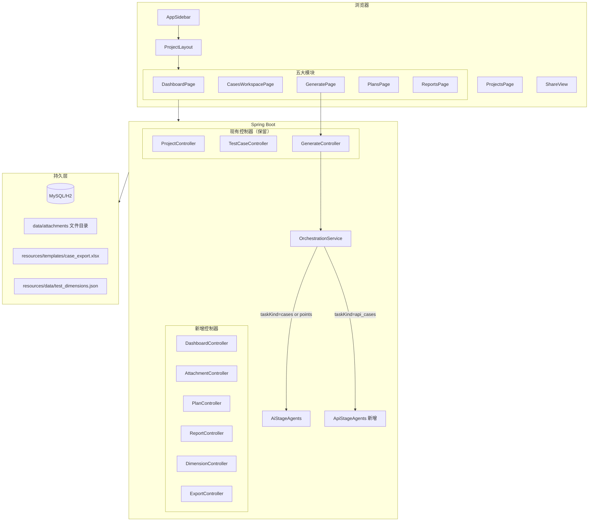
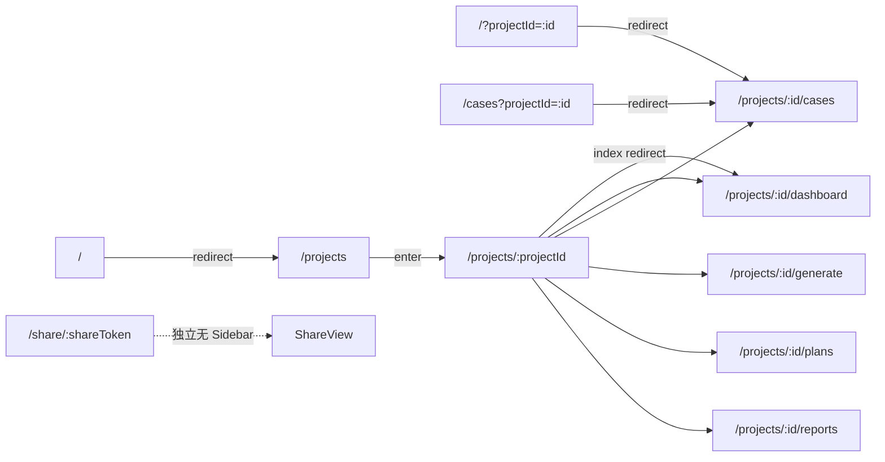
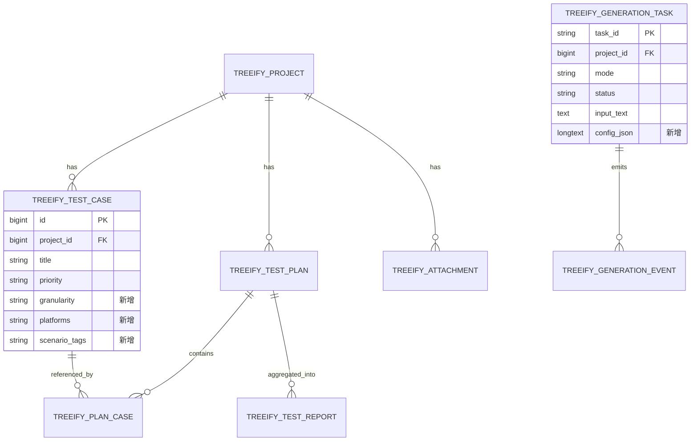
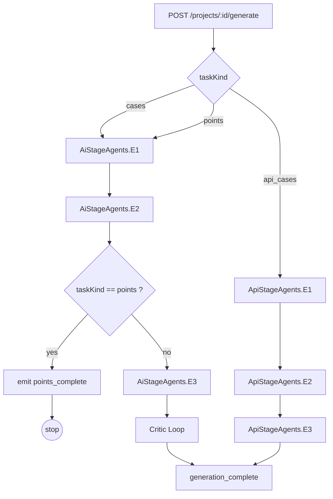
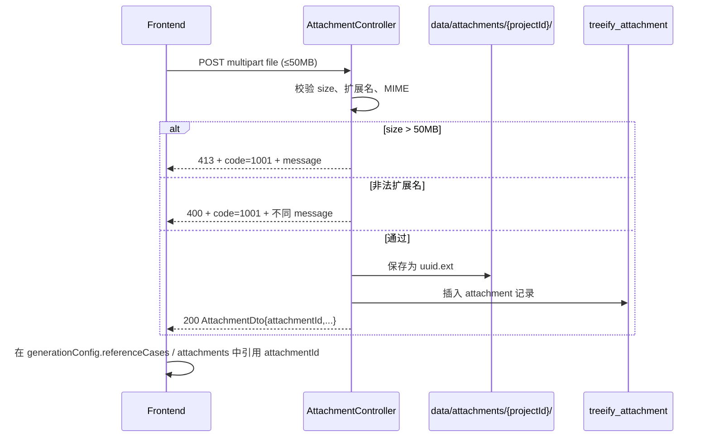
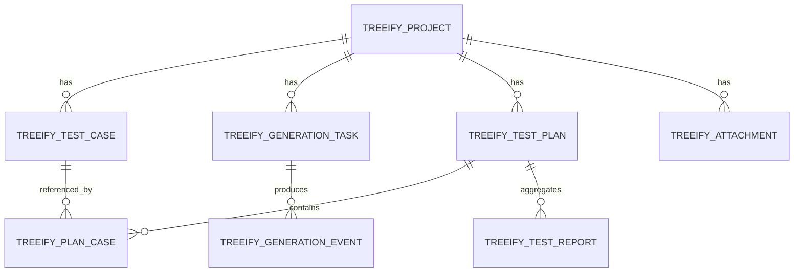
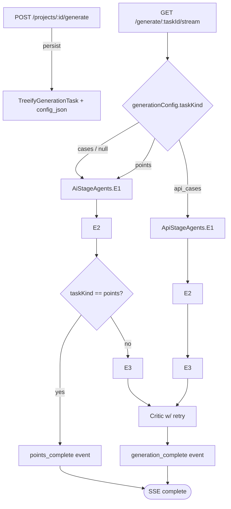
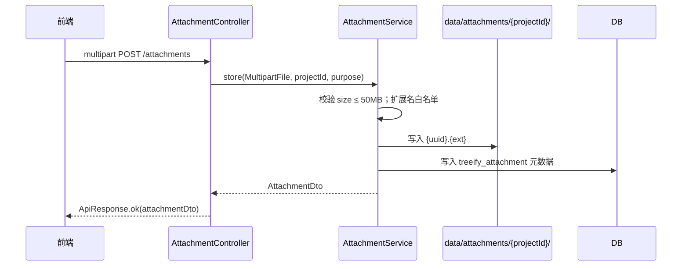
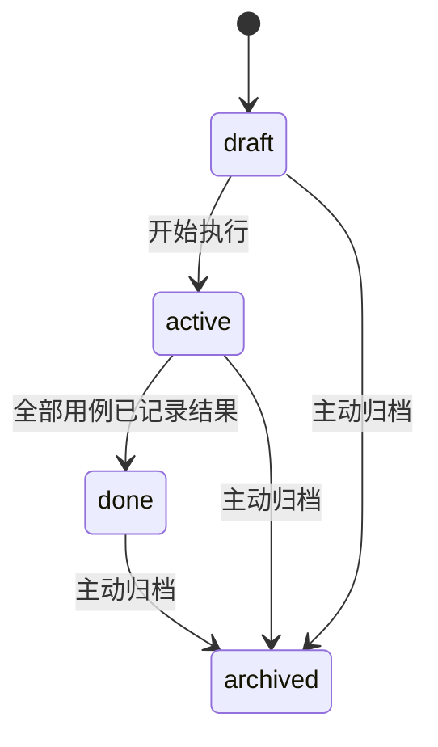

# Design Document

## Overview

本设计文档描述 `testing-platform-revamp` 特性的技术方案，覆盖 requirements.md 中 16 条需求。核心目标是将现有 SpecCase / Treeify 改造为以"测试平台"为统一品牌、以项目为中心的多模块产品，并按图片设计稿重塑用例生成页。

设计遵循以下原则：

1. **零回归**：现有 SSE 契约、`treeify_*` 表、Java 包名、统一响应结构、mock 模式不变。
2. **增量演进**：所有新字段以可空形式追加；附件链路一次性切换为 multipart 直传，不再保留 base64 内嵌。
3. **并行友好**：模块边界沿"前端路由壳 / 前端各页面 / 后端控制器 / 后端服务 / 数据库迁移 / Prompt 注入"切分，每块文件不重叠，可分发给 GPT 帮手并行实施。

## Architecture

### High-level Module Map



### Route Map



### Information Architecture（Sidebar 分组）

| 分组 | 项目 | 路径 | 说明 |
| --- | --- | --- | --- |
| 主模块 | 仪表盘 | `/projects/:id/dashboard` | 项目概览 |
| 主模块 | 用例管理 | `/projects/:id/cases` | 列表 + 思维导图双视图 |
| 主模块 | 用例生成 | `/projects/:id/generate` | 图片设计稿 |
| 主模块 | 测试计划 | `/projects/:id/plans` | 计划 CRUD + 执行 |
| 主模块 | 测试报告 | `/projects/:id/reports` | 报告聚合 + 导出 |
| 系统设置（折叠分组） | 项目管理 | `/projects` | 复用现有 ProjectsPage |
| 系统设置 | 知识库 | 在 Cases 思维导图下打开 KnowledgePanel | 复用现有 |
| 系统设置 | 摘要 | 同上打开 SummaryPanel | 复用现有 |
| 系统设置 | 集成 | 同上打开 IntegrationPanel | 复用现有 |

## Components and Interfaces

### Frontend File Layout

```
frontend/src/
├── main.tsx                                       # 路由表升级
├── App.tsx                                        # 拆解：思维导图工作区迁入 CasesWorkspacePage
├── layouts/
│   └── ProjectLayout.tsx                          # 新增：Sidebar + Outlet
├── components/
│   ├── AppSidebar.tsx                             # 新增
│   ├── ProjectTopBar.tsx                          # 新增
│   ├── GeneratePanel/                             # 重组（原 GeneratePanel.tsx 拆分）
│   │   ├── index.tsx                              # 编排
│   │   ├── RequirementInputCard.tsx               # 文件/文本切换
│   │   ├── DimensionCard.tsx                      # 业务场景 + 三列维度
│   │   ├── GranularityCard.tsx                    # S/M/L
│   │   ├── GenerationConfigCard.tsx               # 平台/输出/Prompt/参考
│   │   ├── GenerationActionBar.tsx                # 双主操作
│   │   ├── HistoryDrawer.tsx                      # 历史记录抽屉
│   │   ├── PointsResultPanel.tsx                  # 测试点结果
│   │   └── ApiTabPanel.tsx                        # 接口测试 Beta
│   └── plans/
│       ├── PlanList.tsx
│       ├── PlanDetail.tsx
│       ├── PlanFormModal.tsx
│       └── PlanExecutionTable.tsx
│   └── reports/
│       ├── ReportList.tsx
│       └── ReportDetail.tsx
├── pages/
│   ├── ProjectsPage.tsx                           # 保留（仅去掉 ?projectId 旧链接的生成）
│   ├── DashboardPage.tsx                          # 新增
│   ├── CasesWorkspacePage.tsx                     # 新增（合并原 App.tsx + CasesPage）
│   ├── GeneratePage.tsx                           # 新增（壳，渲染 GeneratePanel）
│   ├── PlansPage.tsx                              # 新增
│   ├── PlanDetailPage.tsx                         # 新增
│   ├── ReportsPage.tsx                            # 新增
│   ├── ReportDetailPage.tsx                       # 新增
│   ├── CasesPage.tsx                              # 删除（被 CasesWorkspacePage 替代）
│   └── ShareView.tsx                              # 保留
├── features/
│   ├── navigation/
│   │   └── projectNavStore.ts                     # 新增：sidebar collapse / current module
│   ├── generation/
│   │   ├── generationStore.ts                     # 升级：增加 config 字段
│   │   └── useGenerateStream.ts                   # 升级：处理 points_complete
│   ├── plans/usePlanQueries.ts                    # 新增
│   └── reports/useReportQueries.ts                # 新增
├── shared/
│   ├── api/
│   │   ├── treeify.ts                             # 升级
│   │   ├── attachments.ts                         # 新增（multipart 直传）
│   │   ├── plans.ts                               # 新增
│   │   ├── reports.ts                             # 新增
│   │   ├── dashboard.ts                           # 新增
│   │   └── dimensions.ts                          # 新增
│   ├── types/
│   │   ├── treeify.ts                             # 升级
│   │   ├── plan.ts                                # 新增
│   │   ├── report.ts                              # 新增
│   │   └── dashboard.ts                           # 新增
│   └── transforms/treeifyTransforms.ts            # 升级
└── utils/exportCases.ts                           # 升级：增 exportXlsx 调后端
```

### Backend File Layout

```
src/main/java/com/zoujuexian/aiagentdemo/
├── api/controller/treeify/
│   ├── ProjectController.java                     # 保留
│   ├── TestCaseController.java                    # 保留
│   ├── GenerateController.java                    # 升级：history 端点
│   ├── DashboardController.java                   # 新增
│   ├── AttachmentController.java                  # 新增
│   ├── PlanController.java                        # 新增
│   ├── ReportController.java                      # 新增
│   ├── DimensionController.java                   # 新增
│   ├── ExportController.java                      # 新增
│   └── dto/
│       ├── CreateGenerateTaskRequest.java         # 升级：+ generationConfig
│       ├── GenerationConfig.java                  # 新增 record
│       ├── GeneratedCaseDto.java                  # 升级：+ granularity/platforms/scenarioTags
│       ├── AttachmentDto.java                     # 新增
│       ├── CreatePlanRequest.java                 # 新增
│       ├── PlanDto.java                           # 新增
│       ├── PlanCaseDto.java                       # 新增
│       ├── PlanCaseResultRequest.java             # 新增
│       ├── ReportDto.java                         # 新增
│       ├── ReportSummaryDto.java                  # 新增
│       ├── DashboardDto.java                      # 新增
│       └── DimensionsDto.java                     # 新增
├── service/treeify/
│   ├── OrchestrationService.java                  # 升级：taskKind 路由 + config 注入
│   ├── agent/
│   │   ├── AiStageAgents.java                     # 升级：consume GenerationConfig
│   │   ├── ApiStageAgents.java                    # 新增
│   │   └── StageContext.java                      # 升级：+ GenerationConfig 字段
│   ├── PlanService.java                           # 新增
│   ├── ReportService.java                         # 新增
│   ├── AttachmentService.java                     # 新增
│   ├── DashboardService.java                      # 新增
│   ├── ExcelExportService.java                    # 新增
│   └── DimensionService.java                      # 新增
├── domain/entity/
│   ├── TreeifyTestPlan.java                       # 新增
│   ├── TreeifyPlanCase.java                       # 新增
│   ├── TreeifyTestReport.java                     # 新增
│   └── TreeifyAttachment.java                     # 新增
└── domain/repository/
    ├── TreeifyTestPlanRepository.java             # 新增
    ├── TreeifyPlanCaseRepository.java             # 新增
    ├── TreeifyTestReportRepository.java           # 新增
    └── TreeifyAttachmentRepository.java           # 新增

src/main/resources/
├── templates/case_export.xlsx                     # 新增
├── data/test_dimensions.json                      # 新增
└── db/migration/
    └── V2__testing_platform_revamp.sql            # 新增（如已使用 Flyway）
```

如果项目尚未启用 Flyway，则在 `application.properties` 中保持 `spring.jpa.hibernate.ddl-auto=update` 由 JPA 自动处理新增表/列；同时把 SQL DDL 落到 `docs/sql/V2_testing_platform_revamp.sql` 供 DBA 手动执行。

## Data Models

### New Tables (snake_case)

```sql
-- 测试计划
CREATE TABLE treeify_test_plan (
  id            BIGINT AUTO_INCREMENT PRIMARY KEY,
  project_id    BIGINT NOT NULL,
  name          VARCHAR(120) NOT NULL,
  description   TEXT,
  status        VARCHAR(16) NOT NULL DEFAULT 'draft', -- draft|active|done|archived
  start_date    DATETIME,
  end_date      DATETIME,
  owner_id      BIGINT,
  created_at    DATETIME NOT NULL,
  updated_at    DATETIME NOT NULL,
  KEY idx_plan_project (project_id, status)
);

-- 计划与用例关联（执行结果）
CREATE TABLE treeify_plan_case (
  id                BIGINT AUTO_INCREMENT PRIMARY KEY,
  plan_id           BIGINT NOT NULL,
  case_id           BIGINT NOT NULL,
  assignee_id       BIGINT,
  execution_result  VARCHAR(16),  -- pass|fail|blocked|skipped
  note              TEXT,
  executed_at       DATETIME,
  created_at        DATETIME NOT NULL,
  updated_at        DATETIME NOT NULL,
  UNIQUE KEY uk_plan_case (plan_id, case_id),
  KEY idx_plan_case_plan (plan_id),
  KEY idx_plan_case_case (case_id)
);

-- 测试报告
CREATE TABLE treeify_test_report (
  id           BIGINT AUTO_INCREMENT PRIMARY KEY,
  project_id   BIGINT NOT NULL,
  plan_id      BIGINT NOT NULL,
  name         VARCHAR(160) NOT NULL,
  summary_json LONGTEXT NOT NULL,
  created_by   BIGINT,
  created_at   DATETIME NOT NULL,
  KEY idx_report_project (project_id),
  KEY idx_report_plan (plan_id)
);

-- 附件元数据（实际文件落本地磁盘 data/attachments/{projectId}/{uuid}.{ext}）
CREATE TABLE treeify_attachment (
  id            BIGINT AUTO_INCREMENT PRIMARY KEY,
  attachment_id VARCHAR(36) NOT NULL UNIQUE, -- UUID 对前端暴露
  project_id    BIGINT NOT NULL,
  file_name     VARCHAR(255) NOT NULL,
  content_type  VARCHAR(120),
  size          BIGINT NOT NULL,
  storage_path  VARCHAR(512) NOT NULL,
  kind          VARCHAR(16) NOT NULL DEFAULT 'document', -- document|image|reference_case
  created_at    DATETIME NOT NULL,
  KEY idx_attachment_project (project_id)
);
```

### Existing Tables — ALTER

```sql
ALTER TABLE treeify_generation_task
  ADD COLUMN config_json LONGTEXT NULL;

ALTER TABLE treeify_test_case
  ADD COLUMN granularity     VARCHAR(2)   NULL,
  ADD COLUMN platforms       VARCHAR(255) NULL, -- JSON array as string
  ADD COLUMN scenario_tags   VARCHAR(255) NULL; -- JSON array as string
```

### ER Diagram (新增/扩展部分)



### DTO Contracts

#### `GenerationConfig` (新增)

```java
public record GenerationConfig(
    String taskKind,                     // "cases" | "points" | "api_cases"，默认 "cases"
    List<String> businessScenarios,      // ["general","doc","video","all"]
    List<String> dimensions,             // 由 DimensionService 字典约束
    String granularity,                  // "S" | "M" | "L"
    List<String> targetPlatforms,        // ["any","windows","macos","android","ios","web"]
    String outputFormat,                 // "excel" | "table" | "json"
    String customPrompt,                 // 可空
    List<String> referenceCases          // attachmentId 列表
) {}
```

#### `CreateGenerateTaskRequest` (升级)

```java
public record CreateGenerateTaskRequest(
    String mode,
    String input,
    Long prdDocumentId,
    List<Long> contextCaseIds,
    String selectedNodeId,
    List<GenerationAttachmentRequest> attachments,    // 单一新链路：仅含 attachmentId 引用
    GenerationConfig generationConfig                  // 新增，可空
) {}
```

#### `GeneratedCaseDto` (升级)

```java
public record GeneratedCaseDto(
    String title,
    String precondition,
    List<String> steps,
    String expected,
    String priority,
    List<String> tags,
    String source,
    String pathType,
    String draftCaseId,
    List<String> objectIds,
    List<String> requirementIds,
    String granularity,                  // 新增
    List<String> platforms,              // 新增
    List<String> scenarioTags            // 新增
) {}
```

#### `AttachmentDto` (新增)

```java
public record AttachmentDto(
    String attachmentId,
    String fileName,
    String contentType,
    long size,
    String kind
) {}
```

#### `DashboardDto` (新增)

```java
public record DashboardDto(
    long totalCases,
    int passRate,                                // 已裁剪到 [0,100]
    Map<String, Integer> priorityDistribution,   // P0/P1/P2/P3
    List<RecentTaskDto> recentTasks,             // ≤5
    List<RecentPlanDto> recentPlans,             // ≤5
    List<Integer> criticTrend                    // ≤7
) {}
```

#### Plan / Report DTO

```java
public record PlanDto(Long id, Long projectId, String name, String description,
    String status, LocalDateTime startDate, LocalDateTime endDate, Long ownerId,
    int totalCases, int passedCases, LocalDateTime createdAt, LocalDateTime updatedAt) {}

public record PlanCaseDto(Long id, Long planId, Long caseId, String caseTitle,
    Long assigneeId, String executionResult, String note, LocalDateTime executedAt) {}

public record CreatePlanRequest(String name, String description,
    LocalDateTime startDate, LocalDateTime endDate, Long ownerId,
    List<Long> caseIds) {}

public record PlanCaseResultRequest(String executionResult, String note) {}

public record ReportDto(Long id, Long projectId, Long planId, String name,
    ReportSummaryDto summary, LocalDateTime createdAt) {}

public record ReportSummaryDto(int total, int passed, int failed, int blocked, int skipped,
    int passRate, Map<String, Integer> priorityDistribution,
    List<Long> failedCaseIds, List<Long> blockedCaseIds) {}
```

## API Contracts

| Method | Path | 说明 |
| --- | --- | --- |
| GET | `/api/v1/projects/{id}/dashboard` | 仪表盘聚合 |
| POST | `/api/v1/projects/{id}/attachments` | multipart 附件直传 → AttachmentDto |
| GET | `/api/v1/projects/{id}/generate/history` | 历史任务摘要列表（已存在 events 重放接口保留） |
| GET | `/api/v1/generation/dimensions` | 维度字典 |
| POST | `/api/v1/cases/export/excel` | Excel 模板导出（请求体含 `projectId` + 可选 `caseIds`） |
| POST | `/api/v1/projects/{id}/plans` | 创建测试计划 |
| GET | `/api/v1/projects/{id}/plans` | 计划列表 |
| GET | `/api/v1/plans/{planId}` | 计划详情（含 plan_case 列表） |
| PUT | `/api/v1/plans/{planId}` | 更新计划 |
| DELETE | `/api/v1/plans/{planId}` | 删除/归档计划 |
| POST | `/api/v1/plans/{planId}/cases/{caseId}/result` | 提交执行结果 |
| POST | `/api/v1/plans/{planId}/reports` | 由计划生成报告 |
| GET | `/api/v1/projects/{id}/reports` | 报告列表 |
| GET | `/api/v1/reports/{id}` | 报告详情 |
| GET | `/api/v1/reports/{id}/export?format=pdf\|excel` | 报告导出二进制流 |

所有接口走统一响应 `{code,message,data,requestId}`，请求/响应字段使用 camelCase。

## Generation Pipeline

### TaskKind Routing



### Config Injection 路径

```
GenerationConfig
    ↓ stored on TreeifyGenerationTask.config_json
    ↓ read into StageContext.generationConfig (新字段)
    ↓ AiStageAgents.enrichPromptWithConfig(...) 在每个阶段 prompt 头部追加：
        - 业务场景偏向：把 businessScenarios 翻译成"重点关注 X / Y / Z"指令
        - 维度白名单：限定 E2 dimensions 必须落在该集合
        - 颗粒度：S→每对象 2-3 条，M→5-8 条（默认），L→10+ 条
        - 目标平台：作为 tags 注入用例
        - customPrompt：作为追加段
        - referenceCases：解析后取 N 条作为 few-shot
```

### `points_complete` 事件契约

```json
data: {
  "event": "points_complete",
  "taskId": "uuid",
  "stage": "e2",
  "sequence": 6,
  "timestamp": "2026-04-25T10:00:00",
  "payload": {
    "points": [
      {"objectId": "obj-login-flow", "title": "登录主流程测试点", "priority": "P0", "dimensions": ["...", "..."]}
    ]
  }
}
```

仅在 `taskKind=points` 任务下出现；现有 `stage_started/stage_chunk/stage_done/generation_complete` 不变。

## Attachment Pipeline (50MB)



`application.properties` 增加：
```
spring.servlet.multipart.max-file-size=50MB
spring.servlet.multipart.max-request-size=50MB
testing-platform.attachments.dir=data/attachments
```

## Excel Export

`ExcelExportService` 用 Apache POI（项目尚未引入则在 pom 中加 `org.apache.poi:poi-ooxml:5.2.5`）：

1. 加载 `resources/templates/case_export.xlsx` 为模板。
2. 表头由模板第一行驱动，第二行起按列名映射写入：
   - 标题、前置条件、执行步骤（"\n" 拼接）、预期结果、优先级、标签、来源、执行状态、`granularity`、`platforms`、`scenarioTags`。
3. 文件名 `testing-platform-cases-{yyyyMMdd}.xlsx`。
4. 模板缺失或损坏 → 返回 `code=4001` + HTTP 500。

## Dimensions Dictionary

`resources/data/test_dimensions.json` 示例：

```json
{
  "businessScenarios": [
    {"key": "general", "label": "通用"},
    {"key": "doc", "label": "文档产品"},
    {"key": "video", "label": "视频产品"},
    {"key": "all", "label": "全覆盖"}
  ],
  "columns": [
    {
      "title": "通用场景",
      "items": [
        {"key": "positive_flow", "label": "正向流程", "p0": true},
        {"key": "negative_flow", "label": "异常流程", "p0": true},
        {"key": "compatibility", "label": "兼容性测试", "p0": true},
        {"key": "ui_ux", "label": "易用性与 UI", "p0": true}
      ]
    },
    {
      "title": "文档场景",
      "items": [
        {"key": "rich_text_render", "label": "富文本渲染", "p0": true},
        {"key": "co_edit_conflict", "label": "协同编辑冲突", "p0": true},
        {"key": "doc_permission", "label": "文档权限分享", "p0": true},
        {"key": "version_rollback", "label": "版本历史回滚"},
        {"key": "import_export", "label": "导入导出"},
        {"key": "large_file_perf", "label": "大文档性能"}
      ]
    },
    {
      "title": "视频场景",
      "items": [
        {"key": "playback_compat", "label": "播放兼容性", "p0": true},
        {"key": "upload_transcode", "label": "上传与转码", "p0": true},
        {"key": "content_safety", "label": "内容安全"},
        {"key": "subtitle_lang", "label": "字幕多语言"},
        {"key": "rich_media", "label": "富媒体文档"}
      ]
    }
  ]
}
```

`DimensionController.getDimensions()` 在启动时一次性读入并缓存（`ConcurrentHashMap`），运维改 JSON 后重启服务即可生效。

## State Management

### `projectNavStore` (新增 Zustand)

```ts
interface ProjectNavStore {
  sidebarCollapsed: boolean;          // 持久化到 localStorage 'testing-platform.sidebar.collapsed'
  toggleSidebar(): void;
  currentProjectId: number | null;
  setCurrentProjectId(id: number): void;
}
```

### `generationStore` 升级

```ts
interface GenerationStore {
  // 既有字段保留
  config: {
    taskKind: 'cases' | 'points' | 'api_cases';
    businessScenarios: string[];
    dimensions: string[];
    granularity: 'S' | 'M' | 'L';
    targetPlatforms: string[];
    outputFormat: 'excel' | 'table' | 'json';
    customPrompt: string;
    referenceCases: string[];           // attachmentId
  };
  setConfig(patch: Partial<GenerationStore['config']>): void;
  resetConfig(): void;                  // 恢复默认 (taskKind=cases, granularity=M, outputFormat=table, 其余空)
  pointsResult?: PointsResult;          // 新增：消费 points_complete
}
```

## Backward Compatibility

| 旧链路 | 兼容策略 |
| --- | --- |
| `/?projectId=:id` | 入口处用 `<Navigate>` 重定向到 `/projects/:id/cases`，保留 query。 |
| `/cases?projectId=:id` | 同上重定向。 |
| `attachments[].content` (base64) | **不再支持**：本期一次性切换到 multipart 直传 + `attachmentId` 引用；旧客户端必须升级前端代码后再使用生成接口。 |
| `generationConfig=null` | OrchestrationService 视为 `{taskKind:"cases", granularity:null, ...}`，调用既有 AiStageAgents 不带额外约束。 |
| 现有 SSE 事件 | 完全不变，`points_complete` 仅追加。 |
| `VITE_TREEIFY_API_MODE=mock` | 新增的 dashboard / plans / reports / dimensions 都需要 mock 数据；mock 层在 `frontend/src/shared/api/*.ts` 内置 fallback。 |
| `treeify_*` 表名 / Java 包名 | 不动。日志、内部代码注释保留 "Treeify"。 |

## Error Handling

复用 `ApiErrorCode` 枚举，新增条目：

| code | HTTP | 含义 |
| --- | --- | --- |
| 1001 | 413 | 单文件超过 50MB |
| 1001 | 400 | 文件扩展名 / format 参数非法（与 413 用不同 message） |
| 4001 | 500 | Excel 模板缺失或损坏 |

`GlobalExceptionHandler` 增加 `MaxUploadSizeExceededException → 1001/413` 映射。

## Brand Rename Surfaces

| 文件 | 改动 |
| --- | --- |
| `frontend/index.html` | `<title>测试平台</title>` |
| `frontend/src/components/AppSidebar.tsx` | logo 文案 "测试平台" |
| `frontend/src/utils/exportCases.ts` | 默认前缀 `testing-platform-` 替换 `speccase-` |
| `README.md` | H1 改为 "# 测试平台" |
| 现有 `Toolbar.tsx`、`projects` 页面、空状态文案 | grep "SpecCase\|speccase\|Treeify\|项目工作区" 全部改名 |

不动：`com.zoujuexian.aiagentdemo` 包名、`treeify_*` 表前缀、Java 内部日志、`VITE_TREEIFY_*` 环境变量。

## Correctness Properties

### Property 1: RouteRedirectDeterminism

∀ projectId. 访问 `/?projectId=p` 与 `/cases?projectId=p` 必跳转到 `/projects/p/cases`；幂等。

**Validates: Requirements 12.1, 12.2, 4.5, 4.6**

### Property 2: SidebarPersistence

折叠状态 ∈ {true,false}，写入 localStorage 后再读出值相等；首次访问默认 false。

**Validates: Requirements 2.9**

### Property 3: TaskKindRouting

`taskKind=cases` 永不触发 ApiStageAgents；`taskKind=api_cases` 永不触发 AiStageAgents；`taskKind=points` 必且仅在 E2 后发出 `points_complete`，且不发出 `generation_complete`。

**Validates: Requirements 8.4, 8.5, 8.7, 9.4, 9.5**

### Property 4: GranularityBound

颗粒度 S → 每对象用例数 ∈ [2,3]；M → [5,8]；L ≥ 10。生成结束后用 `Map<objectId,count>` 校验。

**Validates: Requirements 6.5, 6.6, 6.7**

### Property 5: ConfigBackwardCompat

当 `generationConfig=null` 时，输出与升级前完全等价（用相同输入跑两次，cases 数组结构等价）。

**Validates: Requirements 7.8, 12.4, 12.5, 15.7**

### Property 6: AttachmentSizeBoundary

`size ≤ 50*1024*1024` 时返回 200；`size = 50*1024*1024+1` 时返回 413+code=1001。

**Validates: Requirements 5.5, 13.2, 13.3**

### Property 7: PassRateClamp

后端任意 (passed,measured) → `passRate` ∈ [0,100]；前端再次裁剪保持幂等。

**Validates: Requirements 3.3**

### Property 8: PlanReportCoherence

报告 summary 中 `total = passed + failed + blocked + skipped + pending(未执行)`；`passRate = round(passed*100/measured)`。

**Validates: Requirements 11.3, 11.4**

### Property 9: ExcelExportRoundtrip

任一确认后用例集合 → 导出 xlsx → 解析回 `GeneratedCaseDto[]`，标题 / 步骤 / 预期与原始等价。

**Validates: Requirements 14.2, 14.6**

### Property 10: PointsCompleteExclusivity

同一 taskId 的事件序列中，`points_complete` 与 `generation_complete` 互斥出现。

**Validates: Requirements 8.5, 8.6, 8.7**


## Parallelization Plan (与 GPT 帮手分工)

| Slice | 主要文件 | 是否独立 | 推荐分配 |
| --- | --- | --- | --- |
| A. 路由壳 + ProjectLayout + Sidebar + 重定向 | `main.tsx`, `layouts/ProjectLayout.tsx`, `components/AppSidebar.tsx`, `components/ProjectTopBar.tsx`, `features/navigation/projectNavStore.ts` | 与 B-G 完全独立 | 主作者（跨多文件，需统一控制） |
| B. 品牌改名扫描 | `index.html`, `README.md`, `Toolbar.tsx`, 各页面文案, `exportCases.ts` 文件名前缀 | 独立 | GPT |
| C. DashboardPage + Backend | 前端 `pages/DashboardPage.tsx` + `shared/api/dashboard.ts`；后端 `DashboardController` + `DashboardService` | 独立 | GPT |
| D. CasesWorkspacePage（List+MindMap 双 Tab） | 拆 `App.tsx` 为 `CasesWorkspacePage.tsx`，删除 `pages/CasesPage.tsx` | 与 A 有路由耦合，建议串行在 A 之后 | 主作者 |
| E. GeneratePage 重构（图片设计稿） | `components/GeneratePanel/*`, `pages/GeneratePage.tsx`, `generationStore.ts` 升级 | 与 H、I 强相关 | 主作者（生成链路） |
| F. 测试计划模块 | 前端 `pages/PlansPage.tsx`, `PlanDetailPage.tsx`, `components/plans/*`；后端 entity/repo/service/controller/DTO；DDL | 独立 | GPT |
| G. 测试报告模块 | 前端 `pages/Reports*`；后端 `ReportService`, `ReportController`, DTO；导出 endpoint | 依赖 F 的 plan 数据，但代码文件独立 | GPT |
| H. 附件直传 + 50MB | `AttachmentController`, `AttachmentService`, `treeify_attachment` 表，前端 `attachments.ts`, `application.properties` | 独立 | GPT |
| I. Prompt 注入 (GenerationConfig) + ApiStageAgents + points_complete | `OrchestrationService`, `AiStageAgents`, `ApiStageAgents`, `StageContext`, DTO | 与 E 紧耦合 | 主作者 |
| J. Excel 模板导出 | `ExcelExportService`, `ExportController`, `case_export.xlsx`, `exportCases.ts.exportXlsx` | 独立 | GPT |
| K. Dimensions 字典 | `DimensionController`, `DimensionService`, `test_dimensions.json`, 前端 `dimensions.ts` | 独立 | GPT |
| L. 历史记录 Drawer | 后端 `GenerateController.history` + `GET /generate/{taskId}/events`（已存在）；前端 `HistoryDrawer` | E 的子任务 | 主作者 |
| M. SQL 迁移 | `docs/sql/V2_testing_platform_revamp.sql` 或 Flyway 脚本 | 独立 | GPT |

合并顺序建议：A → (B + H + K + M 并行) → (C + F + J 并行) → D → E → I → L → G。

## Testing Strategy

- **后端单测**：每个新 Service 至少一个 happy path + 一个错误路径（PlanService 状态机、ReportService 聚合数学、AttachmentService 大小边界、DimensionService JSON 加载失败回退、ExcelExportService 模板缺失）。
- **后端集成测**：`@SpringBootTest` + MockMvc 覆盖新增 Controller 的 200 / 4xx / 5xx 用例。
- **前端单测**（如已有 vitest）：路由重定向、Sidebar collapse 持久化、generationStore.setConfig 合并语义。
- **PBT**：用 fast-check 写 P3/P4/P6/P7/P8 四个属性的属性测试（前端可在 utils 层覆盖；后端可在 Service 层覆盖）。
- **回归**：保留现有用例确认链路 + SSE 测试，确认 `generationConfig=null` 仍按 `taskKind=cases` 跑通；旧 base64 附件链路已移除，回归测试同步删除该路径。

## Open Questions

1. ~~是否本期接入 Flyway？~~ 已决策：**接入**，见第 6.5 节。
2. `referenceCases` few-shot 在 LLM 端的最大 token 预算？建议先按 1500 token 切片，再观察。
3. ~~报告导出 PDF 用什么引擎？~~ 已决策：**OpenPDF 1.3.x**，见第 11.3 节。
4. 测试计划是否需要执行人通知？本期默认无通知，留待后续。
5. ~~是否引入 Ant Design？~~ 已决策：**接入 Ant Design 5**，见第 17 节。
5. 接口测试 Beta 输入是否支持 OpenAPI/Swagger JSON？本期仅文本 + 文件，不解析结构化 API spec。


## 5. DTO 契约

### 5.1 GenerationConfig

`api/controller/treeify/dto/GenerationConfig.java`：

```java
public record GenerationConfig(
    String taskKind,                  // "cases" | "points" | "api_cases"，默认 cases
    List<String> businessScenarios,   // ["general","doc","video","all"]
    List<String> dimensions,          // 来自字典的维度 key
    String granularity,               // "S" | "M" | "L"，默认 M
    List<String> targetPlatforms,     // ["any","windows","macos","android","ios","web"]
    String outputFormat,              // "excel" | "table" | "json"
    String customPrompt,              // 可空
    List<String> referenceCases       // attachmentId[]
) {}
```

所有字段可空；`null` 等价于使用默认值（Req 7.8 / 12.4 / 15.7）。

### 5.2 CreateGenerateTaskRequest 改造

```java
public record CreateGenerateTaskRequest(
    String mode,
    String input,
    Long prdDocumentId,
    List<Long> contextCaseIds,
    String selectedNodeId,
    List<GenerationAttachmentRequest> attachments, // 既有
    GenerationConfig generationConfig              // 新增可空
) {}
```

`GenerationAttachmentRequest` 改为只引用 `attachmentId`：

```java
public record GenerationAttachmentRequest(
    String kind,
    String fileName,
    String contentType,
    Long size,
    String attachmentId    // 必填；从 POST /attachments 返回；缺失则 400 BAD_REQUEST
) {}
```

后端解析顺序：`AttachmentService.read(attachmentId)` 从 `treeify_attachment` 表取 `storage_path` 后读盘 → 抽取文本 / few-shot。**不再支持 base64 内嵌内容**（Req 12.6）。`attachmentId` 缺失或在数据库中不存在时直接 400 拒绝。

### 5.3 GeneratedCaseDto 增量字段

```java
public record GeneratedCaseDto(
    String title,
    String precondition,
    List<String> steps,
    String expected,
    String priority,
    List<String> tags,
    String source,
    String pathType,
    String draftCaseId,
    List<String> objectIds,
    List<String> requirementIds,
    String granularity,        // 新增可空
    List<String> platforms,    // 新增可空
    List<String> scenarioTags  // 新增可空
) {}
```

`TestCaseDto` 同步增加上述三字段（Req 15.5）。

### 5.4 仪表盘 DTO

`api/controller/treeify/dto/DashboardDto.java`：

```java
public record DashboardDto(
    long totalCases,
    int passRate,                                  // 0-100，已 clamp
    Map<String, Integer> priorityDistribution,     // P0/P1/P2/P3 → count
    List<RecentTaskDto> recentTasks,
    List<RecentPlanDto> recentPlans,
    List<Integer> criticTrend                       // 长度 0-7
) {}

public record RecentTaskDto(
    String taskId,
    LocalDateTime createdAt,
    String mode,
    String taskKind,
    String status,
    Integer criticScore,
    String inputSummary
) {}

public record RecentPlanDto(
    Long planId,
    String name,
    String status,
    LocalDateTime startDate,
    LocalDateTime endDate,
    int totalCount,
    int passedCount
) {}
```

### 5.5 Plans / Reports DTO

```java
// dto/plan/
public record TestPlanDto(
    Long planId, Long projectId, String name, String description,
    String status, LocalDateTime startDate, LocalDateTime endDate,
    Long ownerId, int totalCount, int passedCount, int failedCount,
    int blockedCount, int skippedCount, int notRunCount,
    LocalDateTime createdAt, LocalDateTime updatedAt
) {}

public record CreateTestPlanRequest(
    String name, String description,
    LocalDateTime startDate, LocalDateTime endDate,
    List<Long> caseIds, List<Long> assigneeIds
) {}

public record UpdatePlanCaseResultRequest(
    String executionResult, // pass | fail | blocked | skipped
    String note
) {}

public record PlanCaseDto(
    Long planCaseId, Long planId, Long caseId,
    String caseTitle, String priority,
    Long assigneeId, String executionResult, String note,
    LocalDateTime updatedAt
) {}

// dto/report/
public record TestReportDto(
    Long reportId, Long projectId, Long planId, String name,
    int totalCount, int passedCount, int failedCount,
    int blockedCount, int skippedCount, int passRate,
    Map<String, Integer> priorityDistribution,
    List<FailedCaseDto> failedCases,
    List<FailedCaseDto> blockedCases,
    LocalDateTime createdAt
) {}

public record FailedCaseDto(Long caseId, String title, String priority, String note) {}
```

### 5.6 Attachment DTO

```java
public record AttachmentDto(
    String attachmentId, String fileName,
    String contentType, long size, String purpose,
    LocalDateTime createdAt
) {}
```

## 6. 数据库设计

### 6.1 新增 ALTER（既有表）

```sql
-- treeify_generation_task：保存 GenerationConfig 整体
ALTER TABLE treeify_generation_task ADD COLUMN config_json CLOB;

-- treeify_test_case：增量字段
ALTER TABLE treeify_test_case ADD COLUMN granularity   VARCHAR(8);
ALTER TABLE treeify_test_case ADD COLUMN platforms     VARCHAR(512); -- JSON 字符串数组
ALTER TABLE treeify_test_case ADD COLUMN scenario_tags VARCHAR(512); -- JSON 字符串数组
```

H2 file 模式与生产 MySQL 都通过 Flyway 脚本驱动；具体方案见 6.5。`spring.jpa.hibernate.ddl-auto` 由 `update` 改为 `validate`，表结构变更必须经过迁移脚本（Req 15.3「不修改既有列」由 Flyway 脚本审查保证）。

### 6.2 新增表

```sql
-- 测试计划
CREATE TABLE treeify_test_plan (
  id           BIGINT AUTO_INCREMENT PRIMARY KEY,
  project_id   BIGINT NOT NULL,
  name         VARCHAR(200) NOT NULL,
  description  CLOB,
  status       VARCHAR(16) NOT NULL DEFAULT 'draft', -- draft|active|done|archived
  start_date   TIMESTAMP,
  end_date     TIMESTAMP,
  owner_id     BIGINT,
  created_at   TIMESTAMP NOT NULL,
  updated_at   TIMESTAMP NOT NULL
);
CREATE INDEX idx_treeify_test_plan_project ON treeify_test_plan(project_id, status);

-- 计划-用例关联
CREATE TABLE treeify_plan_case (
  id                BIGINT AUTO_INCREMENT PRIMARY KEY,
  plan_id           BIGINT NOT NULL,
  case_id           BIGINT NOT NULL,
  assignee_id       BIGINT,
  execution_result  VARCHAR(16),  -- pass|fail|blocked|skipped|null(未执行)
  note              CLOB,
  created_at        TIMESTAMP NOT NULL,
  updated_at        TIMESTAMP NOT NULL,
  CONSTRAINT uq_plan_case UNIQUE (plan_id, case_id)
);
CREATE INDEX idx_plan_case_plan ON treeify_plan_case(plan_id);
CREATE INDEX idx_plan_case_case ON treeify_plan_case(case_id);

-- 测试报告
CREATE TABLE treeify_test_report (
  id           BIGINT AUTO_INCREMENT PRIMARY KEY,
  project_id   BIGINT NOT NULL,
  plan_id      BIGINT NOT NULL,
  name         VARCHAR(200) NOT NULL,
  summary_json CLOB NOT NULL,    -- 整张报告聚合 JSON
  created_at   TIMESTAMP NOT NULL,
  created_by   BIGINT
);
CREATE INDEX idx_treeify_test_report_project ON treeify_test_report(project_id, plan_id);

-- 大附件元数据（实体落本地磁盘 data/attachments/{projectId}/{uuid}.{ext}）
CREATE TABLE treeify_attachment (
  attachment_id VARCHAR(40) PRIMARY KEY,
  project_id    BIGINT NOT NULL,
  file_name     VARCHAR(255) NOT NULL,
  content_type  VARCHAR(128) NOT NULL,
  size          BIGINT NOT NULL,
  storage_path  VARCHAR(512) NOT NULL,
  purpose       VARCHAR(32) NOT NULL DEFAULT 'requirement', -- requirement|reference_case
  created_at    TIMESTAMP NOT NULL
);
CREATE INDEX idx_treeify_attachment_project ON treeify_attachment(project_id, purpose);
```

### 6.3 实体类约束

- 全部使用 JPA 注解（与现有 `TreeifyTestCase` 风格一致）。
- `treeify_plan_case.execution_result` 取值在 `PlanService` 中校验：`pass|fail|blocked|skipped`，否则抛 `BusinessException(BAD_REQUEST)`。
- `treeify_test_plan.status` 取值在 `PlanService` 中校验：`draft|active|done|archived`。
- `treeify_attachment.storage_path` 永远存绝对路径或基于 `data/attachments` 的相对路径，**禁止跨目录穿越**：拒绝包含 `..`、绝对路径或 `~` 的传入。

### 6.4 数据模型 ER



### 6.5 Flyway 迁移方案

#### 6.5.1 依赖

`pom.xml` 增加：

```xml
<dependency>
  <groupId>org.flywaydb</groupId>
  <artifactId>flyway-core</artifactId>
</dependency>
<!-- MySQL 生产环境 -->
<dependency>
  <groupId>org.flywaydb</groupId>
  <artifactId>flyway-mysql</artifactId>
  <scope>runtime</scope>
</dependency>
```

Spring Boot 4.x 自带 Flyway autoconfigure，启动时自动扫描 `src/main/resources/db/migration/`。

#### 6.5.2 配置变更

`application.properties`：

```properties
# 用 validate 替代 update：表结构必须经迁移脚本，禁止运行时偷偷改表
spring.jpa.hibernate.ddl-auto=validate
spring.flyway.enabled=true
spring.flyway.locations=classpath:db/migration
spring.flyway.baseline-on-migrate=true
spring.flyway.baseline-version=1
```

`baseline-on-migrate=true` 用于把现有数据库（已经被 ddl-auto 创建过表）平滑接管：第一次启动时 Flyway 把当前状态记为 V1，之后只跑 V2+。

#### 6.5.3 脚本规划

```
src/main/resources/db/migration/
├── V1__baseline.sql                       # 现有 8 张表（treeify_project / test_case / generation_task / generation_event / mindmap_node / project_share / project_summary / case_snapshot）的 CREATE TABLE
└── V2__testing_platform_revamp.sql        # 本次新增 4 张表 + 既有表 ALTER
```

V1 脚本通过 `mvn spring-boot:run` 启动一个空数据库实例后用 `SCRIPT TO 'baseline.sql'`（H2）或 `mysqldump --no-data` 导出 schema 反向获得，确保与现有实体一致。

V2 脚本内容即第 6.1 + 6.2 节展示的 ALTER + CREATE TABLE。

#### 6.5.4 H2 / MySQL 兼容写法

H2 与 MySQL 在 `CLOB`、`AUTO_INCREMENT`、`TIMESTAMP` 等关键字上有差异；Flyway 支持按数据库分目录：

```
db/migration/
├── common/V1__baseline.sql       # 共用语法（仅 ANSI SQL 子集）
├── h2/V1__baseline.sql           # H2 专属（CLOB → CLOB；TIMESTAMP）
└── mysql/V1__baseline.sql        # MySQL 专属（CLOB → LONGTEXT；DATETIME）
```

`spring.flyway.locations` 改为 `classpath:db/migration/common,classpath:db/migration/{vendor}`，由 Spring 根据当前数据源 vendor 自动拼接。

#### 6.5.5 回滚策略

Flyway 社区版不支持自动 down 脚本；本期约定：**任何破坏性 DDL（DROP / RENAME / 列类型变更）必须先发"双写迁移"**。本期 V2 只做 CREATE TABLE / ADD COLUMN，全部为非破坏性，不需要 down 脚本。

## 7. 生成管线（taskKind 路由 + Prompt 注入）

### 7.1 流程



### 7.2 OrchestrationService 改造点

- `streamEvents(...)` 签名扩展：增加 `GenerationConfig config` 参数；`GenerateController` 从 task 实体读 `config_json` 反序列化后传入。
- 新方法 `streamEventsForKind(taskId, mode, ctx, config, sink)` 内部根据 `config.taskKind()` 选择 agent map（功能 vs 接口），并控制是否在 E2 后截断。
- `points_complete` 事件 payload 结构：

```json
{
  "event": "points_complete",
  "taskId": "...",
  "stage": null,
  "sequence": N,
  "timestamp": "...",
  "payload": {
    "points": [
      { "objectId": "obj-...", "title": "...", "priority": "P0" }
    ]
  }
}
```

`GenerateSseEventName` 枚举新增 `POINTS_COMPLETE`。

### 7.3 StageContext 扩展

```java
public record StageContext(
    String taskId,
    String input,
    String feedback,
    Map<String, Object> stageResults,
    String projectSummary,
    String ragContext,
    GenerationConfig config   // 新增可空
) { /* withFeedback / withResult / withConfig 同步加 */ }
```

### 7.4 AiStageAgents Prompt 注入策略

在每个 Agent 的 `buildPrompt` 中追加一段「生成约束」block，仅当对应字段非空才输出：

```
【生成约束（来自工作台配置）】
- 业务场景偏向：{businessScenarios join "/"} （从字典语义解释）
- 维度白名单：{dimensions join ", "}（仅在白名单内拆分维度）
- 用例颗粒度：{S→2-3 / M→5-8 / L→10+} 条/对象
- 目标平台：{targetPlatforms join "/"}；用例 tags 中必须带平台标签
- 自定义补充：{customPrompt}
- 参考用例风格：{refSamples 拼接为 few-shot 示例 1-3 条}
```

E3 Prompt 中显式给出每对象数量约束（结合 granularity）；E2 Prompt 中限定 `dimensions[]` 取值。

### 7.5 ApiStageAgents（接口测试 Beta）

新建 `service/treeify/agent/ApiStageAgents.java`，结构镜像 `AiStageAgents`：

| Agent | 输出 schema 主字段 |
| --- | --- |
| `ApiE1Agent` | `apiEndpoints[]`（method/path/description）、`actors[]`、`constraints[]` |
| `ApiE2Agent` | `apiObjects[]`（每个含 endpoint、参数维度、状态码维度、契约维度） |
| `ApiE3Agent` | `apiCases[]`（含 method、url、headers、body、expectedStatus、expectedSchema） |

Critic 复用现有功能测试 Critic（评分维度可继续用 coverage/priority/executability/clarity/risk）。

### 7.6 Bean 装配（TreeifyGenerationConfig）

把 agents 改成两套，按 taskKind 选择：

```java
Map<String, StageAgent> functionalAgents = Map.of("e1", new AiStageAgents.E1Agent(chatClient), …);
Map<String, StageAgent> apiAgents        = Map.of("e1", new ApiStageAgents.E1Agent(chatClient), …);
return new OrchestrationService(functionalAgents, apiAgents, summaryService, knowledgeService, apiKey);
```

## 8. 附件上传与历史回放

### 8.1 AttachmentService 流程



### 8.2 application.properties 配置

```
spring.servlet.multipart.max-file-size=50MB
spring.servlet.multipart.max-request-size=55MB
spring.servlet.multipart.location=./data/uploads-tmp
```

`MaxUploadSizeExceededException` 在 `GlobalExceptionHandler` 中统一映射为 `code=1001`、HTTP 413、消息「单文件不能超过 50MB」（Req 13.3）。空文件 / 非法 MIME 走 `BAD_REQUEST` 但用不同 message，不复用 413（Req 13.3 第二句）。

### 8.3 历史记录接口

```
GET /api/v1/projects/{id}/generate/history?limit=20
```

后端实现：
1. `treeify_generation_task` 按 `created_at desc` 查 N 条；
2. 对每个 taskId 取首尾事件构造 `inputSummary`（截取前 80 字）；
3. 返回 `RecentTaskDto[]`。

`GET /api/v1/generate/{taskId}/events` 已存在，前端重放时按既有逻辑投放给 `useGenerateStream` 状态机即可。

## 9. Excel 导出

### 9.1 依赖与模板

`pom.xml` 增加：

```xml
<dependency>
  <groupId>org.apache.poi</groupId>
  <artifactId>poi-ooxml</artifactId>
  <version>5.2.5</version>
</dependency>
```

模板：`src/main/resources/templates/case_export.xlsx`，固定首行表头。

### 9.2 列映射

| 列 | 来源 |
| --- | --- |
| 用例标题 | `TestCaseDto.title` |
| 前置条件 | `TestCaseDto.precondition` |
| 执行步骤 | `TestCaseDto.steps` 用 `\n` 拼接 |
| 预期结果 | `TestCaseDto.expected` |
| 优先级 | `priority` |
| 标签 | `tags` 逗号拼接 |
| 来源 | `source` |
| 执行状态 | `executionStatus` |
| 颗粒度 | `granularity`（可空） |
| 目标平台 | `platforms` 逗号拼接 |
| 业务场景 | `scenarioTags` 逗号拼接 |

### 9.3 错误码

模板缺失 / 解析失败 → `code=4001`、HTTP 500、message「用例 Excel 模板缺失或损坏」（Req 14.4，复用既有 `VECTORIZATION_FAILED`=4001 的位号语义需扩展，建议 `ApiErrorCode` 增加 `EXPORT_TEMPLATE_INVALID(4002)`，避免与向量化错误混用——见第 12 节）。

## 10. 维度字典

### 10.1 文件

`src/main/resources/data/test_dimensions.json`：

```json
{
  "businessScenarios": [
    { "key": "general", "label": "通用", "p0": false },
    { "key": "doc",     "label": "文档产品", "p0": false },
    { "key": "video",   "label": "视频产品", "p0": false },
    { "key": "all",     "label": "全覆盖", "p0": false }
  ],
  "dimensionColumns": [
    {
      "key": "main",
      "title": "主流程",
      "items": [
        { "key": "happy_path",   "label": "正向流程", "p0": true },
        { "key": "alt_path",     "label": "替代流程", "p0": false }
      ]
    },
    {
      "key": "exception",
      "title": "异常",
      "items": [
        { "key": "input_invalid", "label": "输入校验", "p0": true },
        { "key": "auth",          "label": "权限/状态", "p0": true }
      ]
    },
    {
      "key": "ux",
      "title": "易用性 / 兼容",
      "items": [
        { "key": "compat", "label": "跨平台兼容", "p0": false },
        { "key": "ui",     "label": "UI / 交互",  "p0": false }
      ]
    }
  ]
}
```

### 10.2 接口

```
GET /api/v1/generation/dimensions  →  返回上面 JSON 反序列化结果
```

`DimensionService` 在启动时读取并缓存到内存；前端在 `GeneratePage` 进入时拉取一次，之后驻留 `generationStore.config` 周边的派生缓存，不重复请求。

## 11. Plans / Reports 生命周期

### 11.1 计划状态机



转换规则：

- 任何状态可手工 `archived`。
- `active → done` 由 `PlanService.recomputeStatus(planId)` 在每次 `updatePlanCaseResult` 后判定：当 `not_run = 0` 且总数 > 0 时自动跃迁。
- `draft → active` 必须显式 PUT，前端「开始执行」触发。

### 11.2 报告生成

`POST /api/v1/plans/{planId}/reports`：

1. 读 `treeify_plan_case` 全量行，按 `execution_result` 计数；
2. 关联 `treeify_test_case` 取 `priority` 做分布统计；
3. 失败 / 阻塞列表保留 `caseId`、`title`、`priority`、`note`；
4. 整体序列化成 `summary_json` 落库；
5. 返回 `TestReportDto`。

### 11.3 报告导出

`GET /api/v1/reports/{id}/export?format=pdf|excel`：

- `format=excel`：用 Apache POI 加载模板 `resources/templates/report_export.xlsx`，按报告 `summary_json` 填表头 + 失败/阻塞列表。
- `format=pdf`：用 **OpenPDF 1.3.x**（LGPL/MPL，与商用兼容）渲染。流程：
  1. `ReportPdfTemplate` 用 OpenPDF 的 `Document` + `PdfWriter` API 直接绘制；
  2. 字体使用项目内置 `resources/fonts/NotoSansSC-Regular.ttf` 解决中文乱码；
  3. 标题块（项目名 / 计划名 / 通过率 / 总数）+ 优先级分布饼图（OpenPDF 原生 Chart 不可用，用 `JFreeChart` 输出 PNG 后嵌入）+ 失败/阻塞用例表；
  4. 输出二进制流，`Content-Disposition: attachment; filename="testing-platform-report-{reportId}.pdf"`。
- 非法 format → `code=1001` HTTP 400（Req 11.6）。

依赖：

```xml
<dependency>
  <groupId>com.github.librepdf</groupId>
  <artifactId>openpdf</artifactId>
  <version>1.3.34</version>
</dependency>
<dependency>
  <groupId>org.jfree</groupId>
  <artifactId>jfreechart</artifactId>
  <version>1.5.4</version>
</dependency>
```

字体文件 `NotoSansSC-Regular.ttf` 通过 OFL-1.1 协议获取（Google Fonts），**禁止提交到仓库**：在 `data/fonts/` 下放置，或通过启动脚本下载到 `data/fonts/` 目录；`ReportPdfService` 启动时从 `${pdf.font.path:./data/fonts/NotoSansSC-Regular.ttf}` 加载。

## 12. 错误码与异常处理

### 12.1 ApiErrorCode 扩展

```java
EXPORT_TEMPLATE_INVALID(4002, INTERNAL_SERVER_ERROR, "用例 Excel 模板缺失或损坏"),
EXPORT_PDF_FAILED      (4003, INTERNAL_SERVER_ERROR, "PDF 报告渲染失败"),
ATTACHMENT_TOO_LARGE   (1001, PAYLOAD_TOO_LARGE,    "单文件不能超过 50MB"),
ATTACHMENT_INVALID_TYPE(1001, BAD_REQUEST,          "附件类型不支持"),
PLAN_INVALID_STATE     (1001, BAD_REQUEST,          "测试计划状态非法"),
```

> 注：Req 13.3 强调 413 用于尺寸超限、4xx 不复用，因此 `ATTACHMENT_TOO_LARGE` 单独归 413；`ATTACHMENT_INVALID_TYPE` 走 400。两者 `code` 都用 1001 但 HTTP 状态码不同，前端按 HTTP 状态码区分提示。

### 12.2 GlobalExceptionHandler 新增

```java
@ExceptionHandler(MaxUploadSizeExceededException.class)
ApiResponse<?> handleUploadTooLarge(...) → ATTACHMENT_TOO_LARGE
@ExceptionHandler(MultipartException.class)
ApiResponse<?> handleMultipart(...)      → ATTACHMENT_INVALID_TYPE
```

## 13. 品牌改名清单

| 文件 | 修改 |
| --- | --- |
| `frontend/index.html` | `<title>测试平台</title>` |
| `frontend/src/components/AppSidebar.tsx` | Logo 文案「测试平台」 |
| `README.md` | H1 改「测试平台」，正文删除 SpecCase / Treeify 直接出现 |
| `frontend/src/utils/exportCases.ts` | 文件名前缀 `speccase-` → `testing-platform-` |
| `frontend/src/components/Toolbar.tsx`、`AiAssistantPanel.tsx`、`ShareView.tsx` 等 UI 文案 | 全局搜索替换 |

不改：

- Java 包名 `com.zoujuexian.aiagentdemo`
- 数据库表前缀 `treeify_*`
- 内部日志、`spring.application.name=AiAgentDemo`（属于运维标识，不展示给用户）

## 14. 兼容性策略

| 来源 | 兼容方案 |
| --- | --- |
| 旧前端 `attachments[].content` base64 | **不兼容**：本期已移除该字段，旧前端必须升级到新版本前端才能使用生成接口；后端遇到 `attachmentId` 缺失直接返回 400 + `code=1001`。 |
| 旧前端不带 `generationConfig` | 后端 `taskKind=cases`，其余按既有默认行为；不报错（Req 15.7）。 |
| `VITE_TREEIFY_API_MODE=mock` | 新路由结构下仍能跑：`MockTreeifyService` 接管 ProjectsPage / CasesWorkspacePage / Plans / Reports 的列表查询；mock 数据落同一套 DTO。 |
| 既有思维导图 / 知识库 / 摘要 / Snapshot / 集成 / 分享 | 全部移到「用例管理 → 思维导图视图」与「侧边栏 → 系统设置」；功能行为不变。 |
| `/cases?projectId=`、`/?projectId=` | LegacyRedirect 替换。 |

## 15. 正确性属性（PBT 友好）

| 属性 | 描述 |
| --- | --- |
| P-Route-Redirect-Idempotent | 对 `/?projectId=N`、`/cases?projectId=N` 的多次访问 → 都收敛到 `/projects/N/cases`，URL 决定性。 |
| P-Sidebar-Collapse-Persist | `collapsed` 写入 localStorage 后，下次同源访问 store 初始化值与之相等。 |
| P-Granularity-CaseCount | 任意 `granularity ∈ {S,M,L}` → 每个 E2 对象生成的用例数落在 `[2,3] / [5,8] / [10,30]`。 |
| P-TaskKind-Routing | `taskKind=cases` 永远经 AiStageAgents；`api_cases` 永远经 ApiStageAgents；两者互不调用（Req 9.5）。 |
| P-PointsComplete-Only-When-Points | `points_complete` 事件出现 ⇔ 任务 `taskKind=points`；`taskKind ∈ {cases, api_cases}` 永不出 `points_complete`。 |
| P-Attachment-50MB-Boundary | 上传 ≤ 52,428,800 字节成功；> 52,428,800 拒绝并返回 413 + `code=1001`。 |
| P-Config-Null-Backcompat | 缺省 `generationConfig` 的请求 ⇔ 等价于 `{ taskKind:"cases", granularity:"M", others:default }`。 |
| P-PlanStatus-Monotonic | 在不调用 `archive` 的情况下，状态序列严格单调：`draft → active → done`，不回退。 |
| P-PassRate-Clamp | 任意 `passRate` 输出 ∈ `[0,100]`。 |
| P-DashboardTrend-Length | `criticTrend.length ≤ 7`，元素均 ∈ `[0,100]`。 |
| P-Attachment-IdRequired | `attachments[].attachmentId` 必须非空且能在 `treeify_attachment` 表中命中；任一条件不满足 → 400 + `code=1001`。 |

## 16. 并行实施路线图

### 16.1 Phase 矩阵

| Phase | 主作者（必须独占的关键路径） | GPT 协作者（独立可并行） |
| --- | --- | --- |
| P0 路由壳 | T-RT-1, T-RT-2, T-RT-5 | T-RT-3, T-RT-4, T-RT-6 |
| P1 后端契约 | T-BE-1, T-BE-2, T-BE-3 | T-BE-Att, T-BE-Dim, T-BE-Hist |
| P2 生成页 UI | T-FE-1, T-FE-2, T-FE-6 | T-FE-3, T-FE-4, T-FE-5, T-FE-7 |
| P3 Plans/Reports | （评审 PR） | T-BE-Plan, T-BE-Report, T-FE-9, T-FE-10, T-FE-11 |
| P4 导出/品牌 | （评审 PR） | T-BE-Export, T-FE-8, T-Brand-Rename |

### 16.2 GPT 协作友好性约束

凡标记为「GPT 独立」的任务，必须满足：

1. **触达文件不与他人交叉**：例如 `DimensionService` 完全新建，不修改 `OrchestrationService`。
2. **接口契约由本设计冻结**：GPT 不能随意改字段名、HTTP 方法或错误码。
3. **每个任务自带验收脚本**：`tasks.md` 中每条任务挂 1-2 个手动 / 自动验收点，便于交付前自检。

### 16.3 风险与缓解

| 风险 | 影响 | 缓解 |
| --- | --- | --- |
| GPT 写出的 Service 不调用现有 `BusinessException` | 错误码不统一 | 在 `tasks.md` 明确「错误必须经 ApiErrorCode + BusinessException」 |
| 多人同时改 `OrchestrationService` | 合并冲突 | OrchestrationService 改造仅由主作者承担；GPT 通过新 Bean 注入扩展 |
| H2 + JPA 自动建表与生产 MySQL 不一致 | 生产部署失败 | **本期接入 Flyway**：`V1__baseline.sql` 反向锁定现有表结构，`V2__testing_platform_revamp.sql` 落本设计的 4 张新表 + 6 个新列；H2 / MySQL 走相同脚本。 |
| 50MB 上传缓存挤爆磁盘 | 服务不可用 | `AttachmentService` 增加项目维度配额（后续迭代）；本期仅做单文件限制 + 临时目录 |


## 17. UI 组件库：Ant Design 接入

### 17.1 决策

本期接入 **Ant Design 5.x**，所有新页面（Dashboard、GeneratePage、Plans、Reports、AppSidebar、HistoryDrawer 等）默认使用 antd 组件。现有思维导图工作区（MindMapCanvas / NodeCard / Toolbar 等）继续保持自定义 CSS 不动，**避免大规模视觉返工**。

### 17.2 依赖

`frontend/package.json`：

```json
{
  "dependencies": {
    "antd": "^5.21.0",
    "@ant-design/icons": "^5.5.0",
    "@ant-design/v5-patch-for-react-19": "^1.0.0"
  }
}
```

> Ant Design 5 官方对 React 19 的兼容通过 `@ant-design/v5-patch-for-react-19` 提供，必须引入。否则部分浮层组件（Modal/Drawer/Tooltip）会报错。

### 17.3 全局接入

`frontend/src/main.tsx` 顶层包裹 `ConfigProvider` + `App`：

```tsx
import { ConfigProvider, App as AntdApp, theme } from 'antd';
import zhCN from 'antd/locale/zh_CN';
import '@ant-design/v5-patch-for-react-19';

<ConfigProvider
  locale={zhCN}
  theme={{
    token: { colorPrimary: '#1f6cff', borderRadius: 8 },
    algorithm: theme.defaultAlgorithm
  }}
>
  <AntdApp>
    <BrowserRouter>...</BrowserRouter>
  </AntdApp>
</ConfigProvider>
```

主题色 `#1f6cff` 沿用截图设计稿主蓝。深色模式后续迭代再追。

### 17.4 与既有 CSS 共存策略

| 区域 | UI 来源 |
| --- | --- |
| AppSidebar / ProjectTopBar | antd `Layout.Sider` + `Menu` |
| DashboardPage | antd `Card` + `Statistic` + `Table`；图表用 `@ant-design/charts`（可选，本期可用纯 SVG） |
| GeneratePage 卡片区 | antd `Card` + `Form` + `Checkbox.Group` + `Radio.Group` + `Upload.Dragger` |
| GeneratePage 流式输出区 | 保持现有 `<pre>` 风格（性能 + 渲染顺滑） |
| HistoryDrawer | antd `Drawer` + `List` |
| PlansPage / ReportsPage | antd `Table` + `Tag` + `Modal` |
| 思维导图工作区 | **不变**，保持自定义 CSS |
| 用例管理列表 Tab | 由现有 `CaseTable` 渐进替换为 antd `Table`（本期可不替换，保留现状即可） |

### 17.5 体积评估

按需引入（Vite + esbuild 默认 tree-shake）后，antd 5 的 baseline 体积约 +180KB gzip。`@ant-design/charts` 体积较大，本期 Dashboard 趋势图先用 SVG 自绘，**不引入 charts**。

### 17.6 风险与对策

| 风险 | 对策 |
| --- | --- |
| antd 主题与现有自定义 CSS 冲突 | 用 `:where(.ant-*)` 提升优先级；自定义 CSS 模块限定在 `.mind-map-canvas` 等容器内 |
| Sidebar 折叠动画与 antd Layout 冲突 | 直接使用 antd `Layout.Sider collapsible` 接管动画 |
| react-router 7 + antd Drawer 路由切换时未卸载 | 在 Drawer 的 `useEffect` 中监听 `useLocation` 变化主动 close |

## 18. 设计变更摘要（v1 → v2）

| 项 | v1 决策 | v2 决策 | 影响 |
| --- | --- | --- | --- |
| 数据库迁移 | `ddl-auto=update` + 手写 SQL 旁路 | **接入 Flyway**，`ddl-auto=validate` | 后续所有表结构变更走脚本，零债务 |
| UI 组件库 | 不引入 | **接入 Ant Design 5 + React 19 patch** | 新页面统一视觉，思维导图保持现状 |
| PDF 导出 | NOT_IMPLEMENTED Stub | **接入 OpenPDF + JFreeChart**，需补中文字体 | `format=pdf` 真正可用，新增 `EXPORT_PDF_FAILED(4003)` |
| 附件链路 | 旧 `attachments[].content` base64 与新 `attachmentId` 双路兼容一个版本 | **一次性切换**：仅保留 `attachmentId` 链路 | DTO 简化、后端无双路分支、PBT 改为 `P-Attachment-IdRequired` |
| OrchestrationService 改造 | 同时允许多人并行 | **主作者独占**，GPT 通过新 Bean 注入扩展 | 避免合并冲突；`ApiStageAgents` 同归主作者（与 OrchestrationService 双向耦合） |
| 品牌改名 | UI + 内部都改 | **仅改 UI 可见层**，Java 包名 / `treeify_*` 表前缀 / `spring.application.name` 全部保留 | 减少跨层风险；运维标识不变 |

以上三处决策已在文档对应位置同步更新（6.5 / 11.3 / 12.1 / 17 / 风险表 / Open Questions）。
