# Implementation Plan

## Overview

本计划基于 `requirements.md`（16 条 EARS 需求）与 `design.md`（v2 决策：接入 Flyway / Ant Design 5 / OpenPDF；附件单一新链路；OrchestrationService 主作者独占；品牌仅改 UI 可见层）。

任务划分原则：

- 每条任务**只触达白名单中的文件**，不允许超界，避免 GPT 帮手与主作者改同一文件。
- 每条任务自带 **Owner / Files / Verify / Requirements**，便于派发给子代理或 GPT 后独立验收。
- 任务编号与 design.md 第 16.1 节 Phase 矩阵保持一致。

## Tasks

> 任务 ID 与 design.md 第 16 节 Phase 矩阵对齐；每条任务标注：
>
> - **Owner**：`MAIN`（主作者独占，禁止 GPT 帮手并行）/ `GPT`（GPT 帮手可独立完成）
> - **Files**：本次唯一允许触达的文件白名单
> - **Verify**：交付前自检 / 自动化验收点
> - **_Requirements_**：关联的 EARS 需求编号

## Phase 0 — 路由壳与全局接入

- [ ] 0. 路由壳与全局基础设施（聚合）

  本阶段是后续所有前端任务的基础，必须先完成。

- [ ] 0.1 升级 `main.tsx` 路由表，新增重定向组件 `LegacyRedirect`

  Owner: MAIN

  Files: `frontend/src/main.tsx`, `frontend/src/components/LegacyRedirect.tsx`(new), `frontend/src/main.tsx` 中 ConfigProvider/AntdApp 包裹

  Verify:
  - 浏览器访问 `/` → 跳到 `/projects`
  - 访问 `/?projectId=1`、`/cases?projectId=1` → 跳到 `/projects/1/cases`
  - 访问 `/projects/1` → 跳到 `/projects/1/dashboard`
  - `/share/:shareToken` 仍渲染原 ShareView

  _Requirements: 2.1, 2.2, 2.3, 2.4, 4.5, 4.6, 12.1, 12.2_

- [ ] 0.2 新建 `ProjectLayout` + `AppSidebar` + `ProjectTopBar`

  Owner: MAIN

  Files: `frontend/src/layouts/ProjectLayout.tsx`(new), `frontend/src/components/AppSidebar.tsx`(new), `frontend/src/components/ProjectTopBar.tsx`(new)

  Verify:
  - Sidebar 顶部 Logo 文案为「测试平台」
  - 五条主导航 NavLink 指向正确路径
  - 项目切换下拉来自 `useProjectLoader().projects`
  - 系统设置分组可折叠，包含项目管理 / 知识库 / 摘要 / 集成
  - Sidebar 折叠按钮宽度 220 ↔ 56；状态写入 `localStorage.testing-platform.sidebar.collapsed`，刷新后恢复
  - 已激活 NavLink 再次点击不触发整页刷新

  _Requirements: 1.1, 1.3, 2.5, 2.6, 2.7, 2.8, 2.9, 2.10, 2.11_

- [ ] 0.3 新增 `projectNavStore` 管理侧边栏与当前项目缓存

  Owner: GPT

  Files: `frontend/src/features/navigation/projectNavStore.ts`(new)

  Verify:
  - `collapsed` 默认 false；`toggleSidebar` 反转后写入 localStorage
  - `currentProjectId` 切换不触发重新渲染未订阅组件
  - 单测：localStorage 持久化往返

  _Requirements: 2.7, 2.9_

- [ ] 0.4 占位骨架页面（Dashboard/Plans/PlanDetail/Reports）

  Owner: GPT

  Files: `frontend/src/pages/DashboardPage.tsx`(new), `frontend/src/pages/PlansPage.tsx`(new), `frontend/src/pages/PlanDetailPage.tsx`(new), `frontend/src/pages/ReportsPage.tsx`(new), `frontend/src/pages/ReportDetailPage.tsx`(new)

  Verify:
  - 每个页面显示模块名 + 「即将上线」空状态，不报错
  - 路由能正确进入

  _Requirements: 3.1, 10.1, 11.1_

- [ ] 0.5 拆分 `App.tsx` → `CasesWorkspacePage.tsx`，新增列表 / 思维导图 Tab

  Owner: MAIN

  Files: `frontend/src/pages/CasesWorkspacePage.tsx`(new), `frontend/src/pages/CasesPage.tsx`(delete), `frontend/src/App.tsx`(modify)

  Verify:
  - `/projects/:id/cases` 默认进入「列表视图」（沿用原 CasesPage 能力）
  - 切换到「思维导图视图」渲染原 App.tsx 思维导图工作区与所有现有侧边面板
  - 视图切换状态写入 `localStorage.testing-platform.cases.viewMode`
  - 切换视图不丢失未保存修改

  _Requirements: 4.1, 4.2, 4.3, 4.4, 4.7_

- [ ] 0.6 LegacyRedirect 单测

  Owner: GPT

  Files: `frontend/src/components/__tests__/LegacyRedirect.test.tsx`(new)

  Verify:
  - 验证 `/?projectId=N`、`/cases?projectId=N` 输出 `/projects/N/cases`
  - 缺省 query 时落到 `/projects`

  _Requirements: 12.1, 12.2_

## Phase 1 — 后端契约与基础设施

- [ ] 1. 后端契约扩展与 Flyway 接入（聚合）

- [ ] 1.1 引入 Flyway，编写 V1 baseline + V2 迁移脚本

  Owner: GPT

  Files: `pom.xml`(modify), `src/main/resources/application.properties`(modify), `src/main/resources/db/migration/V1__baseline.sql`(new), `src/main/resources/db/migration/V2__testing_platform_revamp.sql`(new)

  Verify:
  - `mvn -DskipTests package` 通过
  - 启动后 `flyway_schema_history` 表内出现 V1 + V2 两条记录
  - V2 脚本包含：4 张新表 + `treeify_generation_task.config_json` + `treeify_test_case` 三新列
  - `spring.jpa.hibernate.ddl-auto=validate`，启动不报错

  _Requirements: 15.1, 15.2, 15.3_

- [ ] 1.2 新增实体 + Repository（TreeifyTestPlan / TreeifyPlanCase / TreeifyTestReport / TreeifyAttachment），扩展 TreeifyTestCase / TreeifyGenerationTask

  Owner: GPT

  Files:
  - `src/main/java/com/zoujuexian/aiagentdemo/domain/entity/TreeifyTestPlan.java`(new)
  - `src/main/java/com/zoujuexian/aiagentdemo/domain/entity/TreeifyPlanCase.java`(new)
  - `src/main/java/com/zoujuexian/aiagentdemo/domain/entity/TreeifyTestReport.java`(new)
  - `src/main/java/com/zoujuexian/aiagentdemo/domain/entity/TreeifyAttachment.java`(new)
  - `src/main/java/com/zoujuexian/aiagentdemo/domain/entity/TreeifyTestCase.java`(modify: granularity/platforms/scenario_tags 字段)
  - `src/main/java/com/zoujuexian/aiagentdemo/domain/entity/TreeifyGenerationTask.java`(modify: configJson 字段)
  - `src/main/java/com/zoujuexian/aiagentdemo/domain/repository/TreeifyTestPlanRepository.java`(new)
  - `src/main/java/com/zoujuexian/aiagentdemo/domain/repository/TreeifyPlanCaseRepository.java`(new)
  - `src/main/java/com/zoujuexian/aiagentdemo/domain/repository/TreeifyTestReportRepository.java`(new)
  - `src/main/java/com/zoujuexian/aiagentdemo/domain/repository/TreeifyAttachmentRepository.java`(new)

  Verify:
  - JPA `validate` 能通过（实体 ↔ V2 表结构匹配）
  - Repository 方法签名按 design 6.2 / 6.3 约束

  _Requirements: 10.3, 10.4, 11.2, 13.4, 15.1, 15.2_

- [ ] 1.3 新增 DTO：GenerationConfig / 升级 CreateGenerateTaskRequest / GenerationAttachmentRequest / GeneratedCaseDto

  Owner: MAIN

  Files: `src/main/java/com/zoujuexian/aiagentdemo/api/controller/treeify/dto/GenerationConfig.java`(new), `CreateGenerateTaskRequest.java`(modify), `GenerationAttachmentRequest.java`(modify: 删 content, 加 attachmentId), `GeneratedCaseDto.java`(modify: 加 granularity/platforms/scenarioTags)

  Verify:
  - `CreateGenerateTaskRequest.generationConfig` 可空
  - `GenerationAttachmentRequest` 不再含 `content` 字段
  - 单测：JSON 反序列化 `null` config 仍能成功

  _Requirements: 6.6, 7.6, 8.2, 8.3, 9.3, 12.4, 12.5, 12.6, 15.5, 15.6, 15.7_

- [ ] 1.4 OrchestrationService 改造：taskKind 路由 + GenerationConfig 注入 + points_complete 事件

  Owner: MAIN

  Files: `src/main/java/com/zoujuexian/aiagentdemo/service/treeify/OrchestrationService.java`(modify), `src/main/java/com/zoujuexian/aiagentdemo/service/treeify/agent/StageContext.java`(modify: 加 generationConfig 字段), `src/main/java/com/zoujuexian/aiagentdemo/api/controller/treeify/dto/GenerateSseEventName.java`(modify: 加 POINTS_COMPLETE), `src/main/java/com/zoujuexian/aiagentdemo/service/treeify/TreeifyGenerationConfig.java`(modify: 装配双 agents 集合)

  Verify:
  - `taskKind=cases` 走 AiStageAgents 完整 E1→E2→E3→Critic
  - `taskKind=points` 在 E2 后发出 `points_complete` 后停止，不发 generation_complete
  - `taskKind=api_cases` 走 ApiStageAgents
  - `generationConfig=null` 时按 `taskKind=cases` 默认行为执行
  - 集成测试：`MockMvc` SSE 流验证三种 taskKind 的事件序列

  _Requirements: 8.4, 8.5, 8.6, 8.7, 9.4, 9.5, 12.3, 15.7_

- [ ] 1.5 AiStageAgents Prompt 注入 GenerationConfig

  Owner: MAIN

  Files: `src/main/java/com/zoujuexian/aiagentdemo/service/treeify/agent/AiStageAgents.java`(modify)

  Verify:
  - 当 config 提供 `granularity=S` 时 E3 prompt 中限定每对象 2-3 条
  - `granularity=L` 时限定每对象 ≥10 条
  - `dimensions[]` 写进 E2 prompt 作为白名单
  - `targetPlatforms[]` 出现在生成 case 的 tags 中
  - `customPrompt` 追加到每个 stage prompt 末尾
  - PBT：`P-Granularity-CaseCount` 通过 fast-check（在 service 层打桩 LLM）

  _Requirements: 6.5, 6.6, 6.7, 7.7_

- [ ] 1.6 ApiStageAgents 实现（接口测试 Beta）

  Owner: MAIN

  Files: `src/main/java/com/zoujuexian/aiagentdemo/service/treeify/agent/ApiStageAgents.java`(new)

  Verify:
  - 三个 Agent 输出 schema 与 design 7.5 节定义一致（apiEndpoints / apiObjects / apiCases）
  - 不引用 AiStageAgents 任何具体类（仅共享 StageAgent 接口）
  - PBT：`P-TaskKind-Routing` 在 OrchestrationService 集成测试中通过

  _Requirements: 9.4, 9.5_

- [ ] 1.7 GenerateController 升级：history 端点 + taskKind 透传

  Owner: GPT

  Files: `src/main/java/com/zoujuexian/aiagentdemo/api/controller/treeify/GenerateController.java`(modify)

  Verify:
  - `GET /api/v1/projects/{id}/generate/history?limit=20` 返回 RecentTaskDto[]，按 createdAt desc
  - 请求体能正确传递 `generationConfig` 到 OrchestrationService（从 task 实体的 config_json 反序列化）
  - SSE 流支持 `points_complete` 事件透传

  _Requirements: 5.7, 5.8, 5.9, 13.7_

- [ ] 1.8 AttachmentController + AttachmentService（multipart 直传 + 50MB）

  Owner: GPT

  Files:
  - `src/main/java/com/zoujuexian/aiagentdemo/api/controller/treeify/AttachmentController.java`(new)
  - `src/main/java/com/zoujuexian/aiagentdemo/service/treeify/AttachmentService.java`(new)
  - `src/main/java/com/zoujuexian/aiagentdemo/api/controller/treeify/dto/AttachmentDto.java`(new)
  - `src/main/resources/application.properties`(modify: multipart limits + attachments.dir)
  - `src/main/java/com/zoujuexian/aiagentdemo/api/common/ApiErrorCode.java`(modify: 加 ATTACHMENT_TOO_LARGE / ATTACHMENT_INVALID_TYPE / EXPORT_TEMPLATE_INVALID / EXPORT_PDF_FAILED / PLAN_INVALID_STATE)
  - `src/main/java/com/zoujuexian/aiagentdemo/api/common/GlobalExceptionHandler.java`(modify)

  Verify:
  - `POST /api/v1/projects/{id}/attachments` multipart 上传 50MB 文件成功，返回 attachmentId
  - 上传 50MB+1 字节 → 413 + code=1001 + message 提到 50MB
  - 非法 MIME → 400 + code=1001 + 不同 message
  - 文件落在 `data/attachments/{projectId}/{uuid}.{ext}`，禁止 `..` / 绝对路径穿越
  - 数据库 `treeify_attachment` 写入完整元数据
  - PBT：`P-Attachment-50MB-Boundary`、`P-Attachment-IdRequired` 通过

  _Requirements: 5.5, 13.1, 13.2, 13.3, 13.4_

- [ ] 1.9 DimensionController + DimensionService + 字典 JSON

  Owner: GPT

  Files:
  - `src/main/java/com/zoujuexian/aiagentdemo/api/controller/treeify/DimensionController.java`(new)
  - `src/main/java/com/zoujuexian/aiagentdemo/service/treeify/DimensionService.java`(new)
  - `src/main/java/com/zoujuexian/aiagentdemo/api/controller/treeify/dto/DimensionsDto.java`(new)
  - `src/main/resources/data/test_dimensions.json`(new)

  Verify:
  - `GET /api/v1/generation/dimensions` 返回 JSON 字典
  - 字典内容修改后重启服务能反映新内容
  - 缓存命中：第二次请求不读盘

  _Requirements: 6.1, 6.2, 6.3, 6.4_

## Phase 2 — 用例生成页（GeneratePage）

- [ ] 2. 用例生成页重构（聚合）

- [ ] 2.1 generationStore 升级：增加 config 与 pointsResult

  Owner: MAIN

  Files: `frontend/src/features/generation/generationStore.ts`(modify), `frontend/src/types/generation.ts`(modify)

  Verify:
  - 新字段 `config` 默认值符合 design 3.2 节
  - `setConfig(patch)` 浅合并 + 校验枚举
  - `resetConfig()` 恢复默认
  - PBT：setConfig 多次合并的等价性

  _Requirements: 6.6, 7.6, 8.2, 8.3, 9.3_

- [ ] 2.2 RequirementInputCard：文件/文本切换 + 50MB 直传 + 历史按钮

  Owner: MAIN

  Files: `frontend/src/components/GeneratePanel/RequirementInputCard.tsx`(new), `frontend/src/shared/api/attachments.ts`(new)

  Verify:
  - 「文件上传」分段：拖拽接受 .md/.docx/.pdf/.txt，大于 50MB 拒绝
  - 上传走 multipart 直传后端，**不再 base64 嵌 JSON**
  - 「文本输入」分段：粘贴/输入需求文本
  - 右上角「查看功能历史记录」按钮触发 HistoryDrawer
  - 单测：上传错误提示文案命中

  _Requirements: 5.1, 5.2, 5.3, 5.4, 5.5, 5.6, 5.7, 13.1_

- [ ] 2.3 DimensionCard：业务场景 + 三列维度多选

  Owner: GPT

  Files: `frontend/src/components/GeneratePanel/DimensionCard.tsx`(new), `frontend/src/shared/api/dimensions.ts`(new)

  Verify:
  - 启动时调用 `/api/v1/generation/dimensions` 拉字典
  - 业务场景多 Tab 选择
  - 三列细分维度多选，每列「全选 / 清空」
  - P0 项展示标记
  - 选择写入 `generationStore.config.businessScenarios` / `dimensions`

  _Requirements: 6.1, 6.2, 6.3, 6.4, 6.6_

- [ ] 2.4 GranularityCard：S/M/L 单选

  Owner: GPT

  Files: `frontend/src/components/GeneratePanel/GranularityCard.tsx`(new)

  Verify:
  - 默认 M，文案「2-3 / 5-8 / 10+ 条/对象」
  - 单选写入 `generationStore.config.granularity`

  _Requirements: 6.5, 6.6_

- [ ] 2.5 GenerationConfigCard：平台/输出格式/自定义 Prompt/参考用例

  Owner: GPT

  Files: `frontend/src/components/GeneratePanel/GenerationConfigCard.tsx`(new)

  Verify:
  - 目标平台多选（不限 / Windows / macOS / Android / iOS / Web）
  - 输出格式单选（标准用例 Excel / 表格 / JSON）
  - 自定义 Prompt 多行文本
  - 参考用例上传：调 `/attachments` 接口，将返回的 attachmentId 推入 `config.referenceCases`
  - 仅接受 .xlsx/.csv/.json
  - 任意配置变化写入 generationStore

  _Requirements: 7.1, 7.2, 7.3, 7.4, 7.5, 7.6, 7.7, 7.8_

- [ ] 2.6 GenerationActionBar + PointsResultPanel + SSE points_complete 处理

  Owner: MAIN

  Files: `frontend/src/components/GeneratePanel/GenerationActionBar.tsx`(new), `frontend/src/components/GeneratePanel/PointsResultPanel.tsx`(new), `frontend/src/features/generation/useGenerateStream.ts`(modify)

  Verify:
  - 「生成测试用例」→ 提交 `taskKind=cases`
  - 「生成测试点」→ 提交 `taskKind=points`，渲染测试点列表
  - SSE `points_complete` 事件正确关闭流并写入 `pointsResult`
  - 不影响既有 `generation_complete` 流程

  _Requirements: 8.1, 8.2, 8.3, 8.6_

- [ ] 2.7 HistoryDrawer：历史任务列表 + 点击重放 SSE

  Owner: GPT

  Files: `frontend/src/components/GeneratePanel/HistoryDrawer.tsx`(new), `frontend/src/shared/api/generationHistory.ts`(new)

  Verify:
  - 调 `GET /api/v1/projects/{id}/generate/history` 渲染列表
  - 点击某条 → 调 `GET /api/v1/generate/{taskId}/events` 重放，复用现有 useGenerateStream 渲染管线
  - 关闭 Drawer 时停止重放

  _Requirements: 5.8, 5.9, 13.6, 13.7_

- [ ] 2.8 ApiTabPanel：接口测试用例 Beta

  Owner: MAIN

  Files: `frontend/src/components/GeneratePanel/ApiTabPanel.tsx`(new), `frontend/src/components/GeneratePanel/index.tsx`(modify: 加 Tab 切换)

  Verify:
  - 顶部 Tab 切换功能 / 接口
  - Api Tab 显示「Beta」角标
  - 切换不丢失对侧 Tab 输入与配置
  - 「生成接口用例」提交 `taskKind=api_cases`

  _Requirements: 9.1, 9.2, 9.3, 9.6, 9.7_

## Phase 3 — Plans / Reports / Dashboard 模块

- [ ] 3. Plans / Reports / Dashboard 闭环（聚合）

- [ ] 3.1 PlanService + PlanController + DTO

  Owner: GPT

  Files:
  - `src/main/java/com/zoujuexian/aiagentdemo/api/controller/treeify/PlanController.java`(new)
  - `src/main/java/com/zoujuexian/aiagentdemo/service/treeify/PlanService.java`(new)
  - `src/main/java/com/zoujuexian/aiagentdemo/api/controller/treeify/dto/plan/`(new package: TestPlanDto / PlanCaseDto / CreateTestPlanRequest / UpdatePlanCaseResultRequest)

  Verify:
  - 所有 7 个端点（POST/GET 列表/GET 详情/PUT/DELETE/POST result/recompute status）按 design 4.2 节契约
  - 状态机：`draft→active→done|archived`，非法转移返回 `code=PLAN_INVALID_STATE`
  - PBT：`P-PlanStatus-Monotonic`、`P-PassRate-Clamp`

  _Requirements: 10.1, 10.2, 10.3, 10.4, 10.5, 10.6, 10.7, 10.8, 10.9_

- [ ] 3.2 ReportService + ReportController + Excel/PDF 导出

  Owner: GPT

  Files:
  - `src/main/java/com/zoujuexian/aiagentdemo/api/controller/treeify/ReportController.java`(new)
  - `src/main/java/com/zoujuexian/aiagentdemo/service/treeify/ReportService.java`(new)
  - `src/main/java/com/zoujuexian/aiagentdemo/service/treeify/ReportPdfService.java`(new)
  - `src/main/java/com/zoujuexian/aiagentdemo/api/controller/treeify/dto/report/`(new package: TestReportDto / ReportSummaryDto / FailedCaseDto)
  - `src/main/resources/templates/report_export.xlsx`(new)
  - `pom.xml`(modify: 加 OpenPDF + JFreeChart)

  Verify:
  - `POST /api/v1/plans/{planId}/reports` 聚合 plan_case，落库 summary_json
  - `GET /reports/{id}/export?format=excel` 返回 .xlsx
  - `format=pdf` 用 OpenPDF 渲染（含中文字体），含失败/阻塞用例表
  - 非法 format → 400 + code=1001
  - 模板缺失 → 500 + code=4002（Excel）/ code=4003（PDF）
  - PBT：`P-PlanReportCoherence`、`P-ExcelExportRoundtrip`

  _Requirements: 11.1, 11.2, 11.3, 11.4, 11.5, 11.6_

- [ ] 3.3 DashboardController + DashboardService

  Owner: GPT

  Files:
  - `src/main/java/com/zoujuexian/aiagentdemo/api/controller/treeify/DashboardController.java`(new)
  - `src/main/java/com/zoujuexian/aiagentdemo/service/treeify/DashboardService.java`(new)
  - `src/main/java/com/zoujuexian/aiagentdemo/api/controller/treeify/dto/DashboardDto.java`(new)

  Verify:
  - `GET /api/v1/projects/{id}/dashboard` 返回字段集合：totalCases / passRate / priorityDistribution / recentTasks(≤5) / recentPlans(≤5) / criticTrend(≤7)
  - passRate 已 clamp 到 [0,100]
  - PBT：`P-PassRate-Clamp`、`P-DashboardTrend-Length`
  - 复用现有 `getProjectCaseStats`，不引入新统计口径

  _Requirements: 3.1, 3.2, 3.3, 3.4, 3.5, 3.6, 3.7, 3.8, 3.9_

- [ ] 3.4 PlansPage / PlanDetailPage 真实接口对接

  Owner: GPT

  Files: `frontend/src/pages/PlansPage.tsx`(modify), `frontend/src/pages/PlanDetailPage.tsx`(modify), `frontend/src/components/plans/PlanList.tsx`(new), `frontend/src/components/plans/PlanFormModal.tsx`(new), `frontend/src/components/plans/PlanExecutionTable.tsx`(new), `frontend/src/shared/api/plans.ts`(new), `frontend/src/shared/types/plan.ts`(new)

  Verify:
  - 列表渲染计划名 / 状态 / 时间 / 已通过 / 总数
  - 「新建计划」表单：名称必填、可选时间、绑定用例多选
  - 详情页支持每条用例选择 pass/fail/blocked/skipped + 备注
  - 提交执行结果调 `/result` 端点
  - 状态机切换合法（draft→active→done|archived）

  _Requirements: 10.1, 10.2, 10.5, 10.7_

- [ ] 3.5 ReportsPage / ReportDetailPage

  Owner: GPT

  Files: `frontend/src/pages/ReportsPage.tsx`(modify), `frontend/src/pages/ReportDetailPage.tsx`(modify), `frontend/src/components/reports/ReportList.tsx`(new), `frontend/src/components/reports/ReportDetail.tsx`(new), `frontend/src/shared/api/reports.ts`(new), `frontend/src/shared/types/report.ts`(new)

  Verify:
  - 报告列表展示通过率、关联计划、生成时间
  - 详情展示通过率、失败列表、阻塞列表、优先级分布
  - 导出按钮支持 Excel 与 PDF 下载
  - 非法 format 不会被前端发出（按钮限制取值）

  _Requirements: 11.1, 11.4, 11.5, 11.6_

- [ ] 3.6 DashboardPage 真实接口对接

  Owner: GPT

  Files: `frontend/src/pages/DashboardPage.tsx`(modify), `frontend/src/components/dashboard/StatCard.tsx`(new), `frontend/src/components/dashboard/CriticTrendChart.tsx`(new), `frontend/src/shared/api/dashboard.ts`(new), `frontend/src/shared/types/dashboard.ts`(new)

  Verify:
  - 调 `/dashboard` 接口渲染六类信息
  - 错误时显示「重试」按钮，不抛未捕获异常
  - Critic 趋势用纯 SVG 自绘（不引入 charts 库）

  _Requirements: 3.1, 3.2, 3.3, 3.4, 3.5, 3.6, 3.7_

## Phase 4 — 导出 / 品牌改名 / Ant Design 接入

- [ ] 4. 导出能力与全站收尾（聚合）

- [ ] 4.1 ExportController + ExcelExportService（用例 Excel 模板导出）

  Owner: GPT

  Files:
  - `src/main/java/com/zoujuexian/aiagentdemo/api/controller/treeify/ExportController.java`(new)
  - `src/main/java/com/zoujuexian/aiagentdemo/service/treeify/ExcelExportService.java`(new)
  - `src/main/resources/templates/case_export.xlsx`(new)
  - `pom.xml`(modify: 加 poi-ooxml 5.2.5)

  Verify:
  - `POST /api/v1/cases/export/excel` body `{projectId, caseIds?}` 返回二进制
  - `Content-Type` 与 `Content-Disposition` 符合 design 9 节
  - 模板缺失 → code=4002 + 500
  - 缺省 caseIds 导出全部
  - PBT：`P-ExcelExportRoundtrip`

  _Requirements: 14.1, 14.2, 14.3, 14.4, 14.5, 14.6_

- [ ] 4.2 前端 exportXlsx 与导出按钮

  Owner: GPT

  Files: `frontend/src/utils/exportCases.ts`(modify)

  Verify:
  - 新增 `exportXlsx(projectId, caseIds?)` 调后端
  - 前端 JSON / CSV / Markdown 路径不变
  - 默认文件名前缀 `testing-platform-cases-`

  _Requirements: 14.1, 14.6, 1.5_

- [ ] 4.3 品牌改名扫描（仅 UI 可见层）

  Owner: GPT

  Files: `frontend/index.html`(modify), `README.md`(modify), `frontend/src/components/Toolbar.tsx`(modify), `frontend/src/components/AiAssistantPanel.tsx`(modify), `frontend/src/pages/ShareView.tsx`(modify), 以及 grep 命中文案的所有前端文件

  Verify:
  - 全局 grep `SpecCase|speccase|Treeify|项目工作区` 在前端代码、README 中均无匹配
  - Java 包名 `com.zoujuexian.aiagentdemo` 不变
  - 表前缀 `treeify_*` 不变
  - `spring.application.name=AiAgentDemo` 不变

  _Requirements: 1.1, 1.2, 1.3, 1.4, 1.5_

- [ ] 4.4 Ant Design 5 接入（含 React 19 patch）

  Owner: MAIN

  Files: `frontend/package.json`(modify), `frontend/src/main.tsx`(modify: ConfigProvider/AntdApp 包裹)

  Verify:
  - `npm i` 后能正常 `npm run dev`
  - 主题色 `#1f6cff`，中文 locale `zhCN`
  - Drawer / Modal / Tooltip 等浮层在 React 19 下不报错
  - bundle 体积增长 ≤ 220KB gzip
  - 既有思维导图自定义 CSS 样式不被 antd 全局样式打乱

  _Requirements: 2.5, 2.6, 5.1, 5.7_

- [ ] 4.5 GlobalExceptionHandler 完整异常映射

  Owner: GPT

  Files: `src/main/java/com/zoujuexian/aiagentdemo/api/common/GlobalExceptionHandler.java`(modify)

  Verify:
  - `MaxUploadSizeExceededException` → 413 + code=1001 + 「单文件不能超过 50MB」
  - `MultipartException` → 400 + code=1001 + 「附件类型不支持」
  - 模板异常 → code=4002 / 4003 + 500
  - 非法 plan 状态 → code=PLAN_INVALID_STATE + 400

  _Requirements: 11.6, 13.3, 14.4_

- [ ] 4.6 mock 模式补齐

  Owner: GPT

  Files: `frontend/src/shared/api/dashboard.ts`(modify), `frontend/src/shared/api/plans.ts`(modify), `frontend/src/shared/api/reports.ts`(modify), `frontend/src/shared/api/dimensions.ts`(modify), `frontend/src/shared/api/attachments.ts`(modify)

  Verify:
  - `VITE_TREEIFY_API_MODE=mock` 下，五个新模块 API 全部返回桩数据
  - 桩数据满足现有 DTO 类型，前端 UI 渲染正常
  - 不影响 `auto`、`real` 模式

  _Requirements: 12.10_

## Phase 5 — 验证与收口

- [ ] 5. 端到端验证（聚合）

- [ ] 5.1 后端集成测试套件

  Owner: GPT

  Files: `src/test/java/com/zoujuexian/aiagentdemo/api/controller/treeify/`下新增 `DashboardControllerIT.java` / `PlanControllerIT.java` / `ReportControllerIT.java` / `AttachmentControllerIT.java` / `GenerateControllerSseIT.java`

  Verify:
  - 每个新 Controller 有 1 个 happy path + 1 个 4xx + 1 个 5xx 测试
  - SSE 测试覆盖三种 taskKind 的事件序列
  - 全部走真实 Spring 上下文 + H2

  _Requirements: 全部，作为整体回归验证_

- [ ] 5.2 PBT 属性测试

  Owner: GPT

  Files: `src/test/java/com/zoujuexian/aiagentdemo/properties/`(new) 含 jqwik 或 fast-check-style 实现

  Verify:
  - 实现 design 第 15 节 11 条 Property
  - 全部通过

  _Requirements: 验证 design 正确性属性_

- [ ] 5.3 前端关键路径单测

  Owner: GPT

  Files: `frontend/src/**/__tests__/` 新增 LegacyRedirect / projectNavStore / generationStore / RequirementInputCard 上传错误处理 / SSE points_complete

  Verify:
  - vitest 全部通过
  - 覆盖 P-Route-Redirect-Idempotent / P-Sidebar-Collapse-Persist / P-PointsComplete-Only-When-Points

  _Requirements: 12.1, 12.2, 2.9, 8.5, 8.6, 8.7_

- [ ] 5.4 README 与开发者文档更新

  Owner: GPT

  Files: `README.md`(modify), `aiagentdemo/speccase_前后端对接文档.md`(modify or 重写一版「测试平台对接文档」)

  Verify:
  - README 顶部 H1 改为「测试平台」
  - 列出新模块、新 API、env 变量、Flyway 使用方式、附件上传链路
  - 删除旧的 SpecCase / Treeify 描述

  _Requirements: 1.1, 1.3_

## Task Dependency Graph

```mermaid
graph TD
  T0_1[0.1 路由表 + LegacyRedirect]
  T0_2[0.2 ProjectLayout + AppSidebar + TopBar]
  T0_3[0.3 projectNavStore]
  T0_4[0.4 占位骨架页面]
  T0_5[0.5 CasesWorkspacePage 拆分]
  T0_6[0.6 LegacyRedirect 单测]

  T1_1[1.1 Flyway + V1/V2 SQL]
  T1_2[1.2 实体 + Repository]
  T1_3[1.3 GenerationConfig + DTO 升级]
  T1_4[1.4 OrchestrationService 改造]
  T1_5[1.5 AiStageAgents 注入]
  T1_6[1.6 ApiStageAgents]
  T1_7[1.7 GenerateController history]
  T1_8[1.8 AttachmentController/Service]
  T1_9[1.9 DimensionController/Service]

  T2_1[2.1 generationStore 升级]
  T2_2[2.2 RequirementInputCard]
  T2_3[2.3 DimensionCard]
  T2_4[2.4 GranularityCard]
  T2_5[2.5 GenerationConfigCard]
  T2_6[2.6 ActionBar + PointsResultPanel + SSE]
  T2_7[2.7 HistoryDrawer]
  T2_8[2.8 ApiTabPanel]

  T3_1[3.1 PlanService + Controller]
  T3_2[3.2 ReportService + 导出]
  T3_3[3.3 DashboardService + Controller]
  T3_4[3.4 PlansPage 接口对接]
  T3_5[3.5 ReportsPage 接口对接]
  T3_6[3.6 DashboardPage 接口对接]

  T4_1[4.1 ExcelExportService 用例导出]
  T4_2[4.2 前端 exportXlsx]
  T4_3[4.3 品牌改名]
  T4_4[4.4 Ant Design 5 接入]
  T4_5[4.5 GlobalExceptionHandler 完整映射]
  T4_6[4.6 mock 模式补齐]

  T5_1[5.1 后端集成测试]
  T5_2[5.2 PBT 属性测试]
  T5_3[5.3 前端关键路径单测]
  T5_4[5.4 README 与对接文档]

  %% 依赖关系
  T0_1 --> T0_2
  T0_2 --> T0_5
  T0_2 --> T0_4
  T0_1 --> T0_6
  T0_2 --> T4_4

  T1_1 --> T1_2
  T1_2 --> T1_3
  T1_3 --> T1_4
  T1_4 --> T1_5
  T1_4 --> T1_6
  T1_3 --> T1_7
  T1_2 --> T1_8

  T1_3 --> T2_1
  T2_1 --> T2_2
  T2_1 --> T2_3
  T2_1 --> T2_4
  T2_1 --> T2_5
  T2_1 --> T2_6
  T1_4 --> T2_6
  T1_7 --> T2_7
  T1_8 --> T2_2
  T1_8 --> T2_5
  T1_9 --> T2_3
  T2_1 --> T2_8

  T1_2 --> T3_1
  T3_1 --> T3_2
  T1_2 --> T3_3
  T3_1 --> T3_4
  T3_2 --> T3_5
  T3_3 --> T3_6
  T0_4 --> T3_4
  T0_4 --> T3_5
  T0_4 --> T3_6

  T1_2 --> T4_1
  T4_1 --> T4_2
  T1_8 --> T4_5
  T3_1 --> T4_5
  T3_2 --> T4_5

  T2_6 --> T5_1
  T3_2 --> T5_1
  T1_8 --> T5_1
  T3_3 --> T5_1
  T1_5 --> T5_2
  T3_1 --> T5_2
  T3_3 --> T5_2
  T1_8 --> T5_2
  T0_1 --> T5_3
  T0_3 --> T5_3
  T2_1 --> T5_3
  T2_6 --> T5_3
  T4_3 --> T5_4
```



合并顺序建议：Phase 0 → Phase 1（1.1/1.2/1.8/1.9 可与 Phase 0 并行）→ Phase 2（依赖 1.3/1.4）→ Phase 3（依赖 1.2）→ Phase 4 → Phase 5。

### Wave Definitions

按可并行批次切分（同一 wave 内的任务可同时派发）：

```json
{
  "waves": [
    {
      "wave": 1,
      "tasks": ["0.1", "0.3", "0.4", "0.6", "1.1"],
      "description": "路由壳启动 + Flyway baseline，互相独立"
    },
    {
      "wave": 2,
      "tasks": ["0.2", "1.2", "1.9"],
      "description": "ProjectLayout、实体层、字典服务并行"
    },
    {
      "wave": 3,
      "tasks": ["0.5", "1.3", "1.8"],
      "description": "用例工作区拆分、DTO 升级、附件直传"
    },
    {
      "wave": 4,
      "tasks": ["1.4", "1.7", "2.1", "3.3", "4.1"],
      "description": "OrchestrationService 改造与生成 store 升级；Dashboard 与 Excel 导出可并行"
    },
    {
      "wave": 5,
      "tasks": ["1.5", "1.6", "2.3", "2.4", "2.5", "2.7", "3.1", "4.2", "4.3", "4.4"],
      "description": "Prompt 注入、生成页子卡片、Plan 服务、品牌改名、Ant Design 接入"
    },
    {
      "wave": 6,
      "tasks": ["2.2", "2.6", "2.8", "3.2", "3.6", "4.5", "4.6"],
      "description": "需求输入卡 / ActionBar / API Tab；Report 服务；异常处理与 mock 兜底"
    },
    {
      "wave": 7,
      "tasks": ["3.4", "3.5"],
      "description": "前端 Plans / Reports 接口对接"
    },
    {
      "wave": 8,
      "tasks": ["5.1", "5.2", "5.3", "5.4"],
      "description": "集成测试、属性测试、前端单测、文档收口"
    }
  ]
}
```

## Notes

- **OrchestrationService / AiStageAgents / ApiStageAgents 三处由主作者独占**，避免与 GPT 帮手并行写撞车。
- **附件链路一次性切换**：`GenerationAttachmentRequest.content` 字段直接删除，仅保留 `attachmentId`；GPT 帮手在 1.8 完成后，2.2/2.5 才能接入。
- **品牌改名仅改 UI 可见层**：Java 包名 `com.zoujuexian.aiagentdemo`、表前缀 `treeify_*`、`spring.application.name=AiAgentDemo` 全部保留。
- **Ant Design 5 接入由主作者执行（4.4）**，其他人接入新组件前先等 4.4 落地，避免在两套样式系统间反复切。
- **Flyway 接入后** `spring.jpa.hibernate.ddl-auto=validate`，任何后续表结构变化必须新增迁移脚本，不允许实体直接生效。
- 派发给 GPT 时，可以把单条任务的 `Files` + `Verify` + `Requirements` 整段贴给 GPT 当 prompt，附上 design.md 与 requirements.md 的链接即可。

## 任务并行性总结

| Phase | MAIN 必须独占 | GPT 可独立并行 |
| --- | --- | --- |
| 0 路由壳 | 0.1, 0.2, 0.5 | 0.3, 0.4, 0.6 |
| 1 后端契约 | 1.3, 1.4, 1.5, 1.6 | 1.1, 1.2, 1.7, 1.8, 1.9 |
| 2 GeneratePage | 2.1, 2.2, 2.6, 2.8 | 2.3, 2.4, 2.5, 2.7 |
| 3 Plans/Reports/Dashboard | （评审） | 3.1, 3.2, 3.3, 3.4, 3.5, 3.6 |
| 4 收口 | 4.4 | 4.1, 4.2, 4.3, 4.5, 4.6 |
| 5 验证 | （评审） | 5.1, 5.2, 5.3, 5.4 |

依赖建议合并顺序：Phase 0 → Phase 1（1.1/1.2/1.8/1.9 可与 0 并行）→ Phase 2 (依赖 1.3/1.4) → Phase 3（依赖 1.2）→ Phase 4 → Phase 5。
